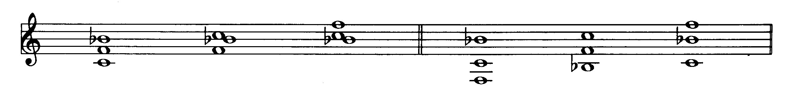

# ARRANGEMENT & COMPOSITION DE LA MUSIQUE DE JAZZ

**UNE APPROCHE LINEAIRE**

Auteur : Bill Dobbins

---

## Préface

L'intention de ce livre est de mettre en lumière une conception claire et économique de l'arrangement et de la composition dans un idiome "jazzistique". Dans mon esprit, cette conception est avant tout linéaire. Le but de cette conception est de donner à chaque instrument, au sein de l'orchestre, une ligne qui soit aussi mélodique que possible. Parfois, ce but peut être atteint grâce aux techniques traditionnelles d'arrangement ou d'harmonisation d'une mélodie. Souvent, cependant, deux ou plusieurs techniques peuvent être combinées pour obtenir un son plus riche, plus coloré. Et quelquefois il est possible de donner à chaque instrument à vent une ligne harmonieuse et mélodiquement indépendante, tout en créant, en même temps, une forte sensation de mouvement harmonique.

Je pense qu'il est important de donner une bonne ligne mélodique à chaque instrument, pour deux raisons :

Premièrement, quand chaque musicien dans un ensemble joue une partition qui possède un sens musical intéressant et qui est agréable à jouer, alors chacun est à même d'interpréter cette musique avec beaucoup plus d'enthousiasme et de conviction.

Deuxièmement, quand les lignes individuelles se meuvent d'une manière claire et convaincante, la structure de la musique est plus puissante et plus riche.

J'ai découvert ces idées fondamentales en étudiant la musique du plus grand de tous les compositeurs de jazz : Duke Ellington. Je me demandais toujours pourquoi la musique de Duke Ellington était constamment plus colorée, plus éclatante que celle de la plupart des autres compositeurs de jazz. Bien sûr, la chaleur et le "son" personnel de chaque musicien en était un facteur important. Pourtant, après avoir transcrit soigneusement une partie de cette musique, je commençai à remarquer qu'il n'y avait que très peu de redoublements des mêmes sons, et qu'une ou plusieurs des voix au-dessous de la mélodie se déplaçaient souvent de façon indépendante. D'une manière plus importante encore, ce déplacement indépendant était un moyen de donner à chaque instrument une bonne ligne mélodique. Ce n'était pas non plus un étalage de technique, ou l'utilisation de la complexité pour son seul intérêt. Il a été rapporté qu'après la répétition d'un de ses nouveaux morceaux avec l'orchestre d'Ellington, Billy Strayhorn demandait toujours à chacun des musiciens s'il avait apprécié sa partition. À cause de cet intérêt pour des lignes mélodiques individuelles puissantes, Ellington et Strayhorn obtenaient souvent un son plus riche avec trois ou quatre instruments à vent que la plupart des compositeurs avec six ou huit. La musique d'Ellington semble aussi être le meilleur exemple de l'économie de moyens, dans la tradition "jazzistique" : la capacité de pouvoir exprimer une idée musicale de façon parfaitement claire, avec le moins de notes possibles. Tout arrangeur ou compositeur de jazz important de ces quarante dernières années a, et cela est reconnu, été influencé par cet aspect du travail d'Ellington.

L'économie en musique est un sujet tout aussi important. Il est primordial pour un jeune arrangeur ou compositeur d'entendre chaque nouveau morceau interprété, afin de pouvoir étudier la clarté de l'expression musicale et du développement. D'une façon générale, il est plus facile de réunir quatre ou cinq instruments à vent et une section rythmique qu'un grand orchestre complet. Les petits groupes ont beaucoup plus de chances de se produire puisqu'ils peuvent se déplacer d'une manière beaucoup moins onéreuse que les grands ensembles. Ce livre se concentrera sur la composition et l'arrangement pour de petites formations comprenant de deux à cinq instruments à vent et une section rythmique. Pour montrer, avec clarté, toutes les techniques et tous les styles, j'ai choisi deux compositions originales et personnelles de caractère différent. *Minor D* est un blues mineur harmoniquement simple. La mélodie comporte peu de notes et elle est jouée à un tempo relativement lent. *Blues for Barry* est un blues majeur harmoniquement complexe. La mélodie comporte plus de notes et est jouée à un tempo plus rapide. La forme du blues a été choisie pour que des arrangements de chacun de ces morceaux puissent être inclus dans le Chapitre Sept. Pour montrer un développement formel, six ou huit "structures" (chorus(es) : voir glossaire) d'une forme courte (comme, par exemple, le blues) offrent plus de possibilités que deux ou trois "structures" (chorus(es) : voir glossaire) d'une forme plus longue. Une composition étendue, en trois mouvements, est cependant incluse, de manière à montrer davantage de possibilités en ce qui concerne l'équilibre entre les variations musicales et l'unité structurale sur une large échelle. En étudiant plusieurs manières possibles d'arranger les mêmes morceaux pour deux, trois, quatre, cinq instruments à vent, une compréhension claire des techniques de base de l'arrangement émergera, en même temps qu'une idée claire des possibilités plus avancées de l'*approche linéaire*. Quand cinq instruments à vent pourront être utilisés économiquement et avec efficacité, il sera assez facile de commencer à écrire pour un grand orchestre. Pour l'étude de l'arrangement et de la composition pour grand orchestre, je recommande Inside the Score par Rayburn Wright (Kendor Music Inc.). Je pense que ce livre représente le meilleur ouvrage actuellement disponible pour l'étude de l'écriture pour grand orchestre, et cela pour deux raisons :

Premièrement, il renferme les orchestrations (scores : voir glossaire) complètes de compositions de trois compositeurs pour grand orchestre les plus représentatifs de la musique de jazz depuis Ellington : Sammy Nestico, Thad Jones et Bob Brookmeyer.

Deuxièmement, la discussion et l'analyse de l'écriture et des styles par Rayburn Wright sont claires, apportant des éclaircissements et une contribution bienvenue quant à la compréhension et à la continuation de cette importante tradition musicale.

En écoutant les disques des grands orchestres mentionnés sur la liste de la discographie finale, l'élève-arrangeur sera capable de découvrir de nombreuses occasions d'employer des techniques d'écriture pour petites formations à l'intérieur des arrangements pour grand orchestre. Duke Ellington, Billy Strayhorn, Gil Evans, Gerry Mulligan, George Russell, Bob Brookmeyer et Clare Fischer ont tous fait un usage très efficace de petits groupes d'instruments à l'intérieur d'un large ensemble.

La discographie à la fin de chaque chapitre sera utile pour une étude plus poussée de chaque instrumentation particulière. L'élève-arrangeur devra transcrire certaines parties de ces enregistrements de façon à développer une oreille plus sensible et plus fine. En commençant avec des enregistrements de groupes comportant deux instruments à vent il sera possible, après quelques années de travail méthodique, d'entendre des textures comportant quatre ou cinq instruments à vent avec une précision satisfaisante.

Ce développement de l'oreille est essentiel, à la fois pour l'appréciation et la compréhension des arrangements et compositions de jazz classique, et pour développer éventuellement une approche plus personnelle de l'écriture de la musique de jazz. C'est peut-être une bonne chose que l'on ne puisse se procurer, en les achetant, les conducteurs, les arrangements (scores : voir glossaire) des plus grandes oeuvres de jazz. Cet état de chose protège la musique de ceux qui pourraient s'en servir d'une manière irresponsable. Les seuls musiciens qui étudient la musique complètement et avec précision sont ceux dont les oreilles et le coeur sont suffisamment sensibles pour la recevoir.

## Harmonisation d'une mélodie :  les techniques de base et l'*approche linéaire*

L'aptitude à harmoniser n'importe quelle mélodie donnée dans un style approprié est un savoir-faire essentiel pour l'arrangeur professionnel. L'harmonisation traditionnelle à quatre voix en position fermée (close position : voir glossaire) sera la façon la plus pratique pour expliquer les techniques de base de l'harmonisation d'une mélodie. En effet, quatre voix sont nécessaires pour exprimer la majeure partie des accords employés généralement dans la musique de jazz, et de plus l'harmonisation en position fermée (close position : voir glossaire) facilite l'identification de chaque note de l'accord par rapport à la fondamentale de cet accord. Les harmonisations (voicings : voir glossaire) contiendront généralement la fondamentale, la tierce, la quinte et la septième, ou bien la tierce, la quinte, la septième et la neuvième, tout en sachant que ces quatre notes pourront être altérées chromatiquement.

L'*approche linéaire* s'explique plus facilement en utilisant des harmonisations (voicings : voir glossaire) en position ouverte (open position : voir glossaire). Les harmonisations en position ouverte donnent la possibilité à l'auditeur d'entendre les lignes instrumentales individuelles avec plus de facilité. Cependant, avant d'examiner les techniques, il est nécessaire d'analyser la mélodie donnée selon les critères suivants :

1. Arpèges ou mouvement d'une note de l'accord à une autre note de l'accord.

2. Gamme ou fragments de gamme.

3. Mouvement mélodique par demi-ton.

4. La relation de chaque note de la mélodie avec l'accord l'accompagnant.

**[L'exemple 1](1.jpg)** comprend la mélodie et la progression d'accords de *Minor D* avec une analyse des particularités mentionnées ci-dessus.

**[L'exemple 2](2.pdf)** comprend cinq harmonisations différentes de *Minor D*.

Les deux premières, A et A1, sont écrites dans un style assez classique ressemblant à celui des arrangeurs Neal Hefti et Sammy Nestico.

[version A (position fermée)](2ac.mp3)
[version A (position ouverte)](2ao.mp3?start=5)
[version A1 (position fermée)](2a1c.mp3?start=5.5)
[version A1 (position ouverte)](2a1o.mp3?start=5.5)

La version B utilise des éléments de style que l'on associe à Duke Ellington et Billy Strayhorn.

[version B (position fermée)](2bc.mp3?start=5.5)
[version B (position ouverte)](2bo.mp3?start=4.5)

La version C est écrite dans un style semblable à l'écriture à quatre voix employée par Oliver Nelson.

[version C (position fermée)](2cc.mp3?start=6)
[version C (position ouverte)](2co.mp3?start=5)

La version D évoque l'oeuvre et les travaux de Gil Evans dans les années soixante.

[version D](2d.mp3?start=4)

Toutes ces différentes harmonisations mettent clairement en lumière l'ensemble des techniques de base d'harmonisation ainsi que l'*approche linéaire*. On peut remarquer que les fondamentales des accords sont souvent omises dans les harmonisations étant donné qu'elles sont jouées par la contrebasse au sein de la section rythmique. L'étude détaillée de la section rythmique sera réalisée au paragraphe 3. Les différentes versions de *Minor D* sont disposées les unes sous les autres de manière à ce que les variations harmoniques puissent être aisément comparées. Dans chaque version, la progression des accords fondamentaux est écrite au-dessus de la mélodie (comme dans une partition normale), les accords de base de l'harmonisation de la mélodie apparaissent en dessous de la portée, et les notes spécifiques utilisées pour chaque harmonisation sont écrites sous le symbole de chaque accord. Nous allons examiner chaque version en détails.

### [Mesures 1 à 3](2.pdf#page=1)

La mélodie est formée d'un fragment de la gamme de Ré dorien entre les notes La et Do.

La version A emploie la technique de base du *parallélisme diatonique*. Les quatre voix se déplacent parallèlement dans la gamme de l'accord. Les deux notes fondamentales de l'accord de la mélodie (La et Do) sont harmonisées avec les degrés 1-3-5-7 et 3-5-7-9 de l'accord de Ré mineur dorien (Dm dorian), la note de passage Si♮ est harmonisée avec les degrés 1-3-5-7 de Mi mineur, l'accord diatonique voisin dans la gamme de Ré dorien (D dorian).

[version A (position fermée)](2ac.mp3){.reset}
[version A (position ouverte)](2ao.mp3?start=5){.reset}

---

La version A1 emploie la technique de la *tonicisation*. L'accord du moment est traité comme un accord de tonique temporaire. Une progression d'accord est alors construite qui arrive à cet accord de tonique temporaire. Dans cet exemple, on utilise la forme de *tonicisation* la plus élémentaire. La note de passage Si♭ est harmonisée avec les degrés 3-5-7-9 de l'accord de dominante de Rém7 (l'accord du moment). Cela aboutit à la progression Rém7-La7-Rém7.

[version A1 (position fermée)](2a1c.mp3?start=6){.reset}
[version A1 (position ouverte)](2a1o.mp3?start=5.5){.reset}

---

La version B emploie la technique fondamentale du *parallélisme chromatique*. Quand la mélodie se déplace par demi-ton (de Si♮ à Do), on emploie les degrés 3-5-7-9 des accords Do♯m7 et Rém7. En conséquence, les quatre voix se déplacent d'une manière chromatiquement parallèle. La note de passage descendante est cependant harmonisée en se servant du *parallélisme diatonique* comme dans la version A. Étant donné que la note de passage descendante se résout sur la note suivante avec un intervalle de un ton, la technique du *parallélisme diatonique* entraîne une progression harmonique beaucoup plus convaincante. Cela donne aussi des lignes mélodiques plus puissantes dans la deuxième et la quatrième voix.

[version B (position fermée)](2bc.mp3?start=5.5){.reset}
[version B (position ouverte)](2bo.mp3?start=4.5){.reset}

---

La version C harmonise l'intervalle par ton de La à Si en se servant du *parallélisme chromatique* (3-5-7-9 degrés de Ré mineur à Mi mineur). Ceci engendre deux nouveaux sons : intervalles de seconde mineure dans les voix inférieures et une relation d'harmonie croisée qui provient de l'alternance des notes Fa♯ et Fa dans la tonalité de Ré mineur. La troisième voix (Mi, Fa♯, Fa, Fa♯) est gauche, peu élégante à jouer puisqu'elle n'est pas très mélodique et difficile à entendre par rapport à la tonalité de Ré mineur. Bien que le son coloré de cette version puisse justifier cette maladresse, la version D offre une solution bien meilleure avec une harmonisation en position ouverte (open position : voir glossaire).

[version C (position fermée)](2cc.mp3?start=5.3){.reset}
[version C (position ouverte)](2co.mp3?start=4.8){.reset}

---

La version D arrange les mêmes notes contenues dans la version C, mais en utilisant l'*approche linéaire*. Les deuxième et quatrième voix se déplacent d'une façon plus indépendante par rapport à la mélodie, mais elles sont faciles à entendre et à jouer. De plus, la troisième voix de la version C, gauche et maladroite, emploie maintenant la note Fa♯ d'une manière beaucoup plus mélodique.

[version D](2d.mp3?start=4){.reset}

La solution ci-dessous peut être utilisée en "position fermée" (close position : voir glossaire) si les deuxième et quatrième voix se croisent comme le montre l'exemple ci-dessous.

La version ci-dessus sera efficace si l'objectif est simplement d'arriver à ce que les lignes de chaque musicien soient plus faciles à jouer. Mais, si le but recherché est d'attirer l'attention sur les lignes elles-mêmes, la solution en "position ouverte" (open position : voir glossaire) de la version D sera plus efficace.

Les solutions auxquelles on aboutit par l'emploi de l'*approche linéaire* ne seront jamais découvertes par des arrangeurs qui ne pensent qu'en termes de progressions harmoniques et d'harmonisations verticales d'accords. L'*approche linéaire* est basée sur l'idée que l'harmonie la plus forte est actuellement le contrepoint, même si les différentes lignes se déplacent d'une manière rythmiquement identique.

Dans les trois premières mesures de *Minor D*, les notes La et Do sont des notes fondamentales de l'accord du moment (Rém7). C'est la note de passage Si♭, dès lors, qui a le plus de possibilités en termes d'harmonisations différentes. En règle générale, il est préférable d'harmoniser les notes fondamentales de l'accord en premier, spécialement celles qui se rencontrent sur les temps forts ou celles qui sont soutenues sur une longue durée. Les autres notes seront harmonisées ensuite, en se servant des techniques de base mentionnées ci-dessus.

### [Mesure 4](2.pdf#page=2)

La mélodie approche par demi-ton la quinte augmentée de l'accord Ré7 avec un mouvement ascendant.

La version A utilise la technique d'harmonisation la plus évidente: le *parallélisme chromatique*. Premièrement, la note Si♭ est harmonisée avec les degrés 3-5-7-9 altérés de Ré7. Les quatre voix se déplacent ensuite chromatiquement et parallèlement à la mélodie.

[version A (position fermée)](2ac.mp3?start=6.8){.reset}
[version A (position ouverte)](2ao.mp3?start=11.8){.reset}

---

La version A1 utilise la même technique, mais avec une harmonisation différente de Ré7. Écoutez attentivement les subtiles différences de son entre les deux harmonisations de Ré7. Il est extrêmement important d'avoir conscience de ces différences de sons créées par les plus petites modifications harmoniques.

[version A1 (position fermée)](2a1c.mp3?start=12.1){.reset}
[version A1 (position ouverte)](2a1o.mp3?start=12.3){.reset}

---

La version B emploie la technique de la *tonicisation* (La7 est l'accord de dominante de Ré7). Remarquons que la deuxième et la quatrième voix se déplacent vers le bas par ton, pendant que la première et la troisième voix se déplacent vers le haut par ton également. Le mouvement contraire peut être employé avec efficacité pour mettre l'accent sur une phrase particulière ou sur un fragment mélodique.

[version B (position fermée)](2bc.mp3?start=11.8){.reset}
[version B (position ouverte)](2bo.mp3?start=11.1){.reset}

---

La version C continue l'accord de Rém7 sur la première croche de cette mesure. On trouve un mouvement contraire à la troisième voix, et une note répétée dans la quatrième voix. Lorsqu'on harmonise une ligne mélodique dans laquelle on trouve des croches chaque fois différentes, les répétitions d'une même note doivent être évitées, sauf si cette répétition de note se produit aussi dans la ligne mélodique. Il est souvent difficile pour les instrumentistes à vent de phraser ensemble lorsque certains ont des notes répétées et d'autres pas. Il n'y a cependant pas de problème réel dans cette mesure, du fait qu'il n'y a que deux notes répétées et que le tempo n'est pas très rapide.

[version C (position fermée)](2cc.mp3?start=12.1){.reset}
[version C (position ouverte)](2co.mp3?start=11.5){.reset}

---

La version D emploie une pure *approche linéaire*. Le premier accord (voicing : voir glossaire) n'a pas de relation harmonique réelle avec Ré7. Il peut être analysé comme étant un accord parfait à trois sons de Fa♯ mineur (triad : voir glossaire) avec la septième majeure à la voix la plus basse, ou bien comme un accord de RéMaj7 avec une tierce mineure à la voix la plus basse. Dans ces deux cas, il s'agit seulement d'une sonorité de passage qui n'a pas de fonction harmonique. La deuxième et la troisième voix sont des notes de passage chromatiques qui se dirigent vers la neuvième augmentée et la septième de Ré7, pendant que la quatrième voix, par demi-ton chromatique, retourne à la tierce de l'accord Ré7. Cette solution linéaire "sonne" de façon convaincante pour deux raisons : premièrement, les trois voix supérieures forment un simple accord mineur de trois sons (triad) qui rend la dissonance de la quatrième voix moins stridente ; deuxièmement, et surtout, la dissonance se résout immédiatement par un enchaînement de notes (voice leading) sans à-coups. Cette solution n'a pu être découverte qu'à l'aide d'une expérimentation des différentes possibilités d'enchaînement des notes (voice leading). C'est un exemple parfait d'*approche linéaire*. Un traitement légèrement plus conventionnel est montré ci-dessous.

[version D](2d.mp3?start=10.8){.reset}

### [Mesures 5 et 6](2.pdf#page=2)

La mélodie est formée d'un fragment de la gamme de Sol dorien. Je dis Sol dorien puisque la sixte majeure (Mi naturel) est sous-entendue par l'armure, à la clé du morceau, et qu'il n'y a pas de Mi, à proximité, dans la ligne mélodique.

La version A emploie la technique la plus fondamentale : le *parallélisme diatonique*.

[version A (position fermée)](2ac.mp3?start=8.8){.reset}
[version A (position ouverte)](2ao.mp3?start=13.8){.reset}

---

La version A1 emploie la *tonicisation*. Fa♯°7 est l'accord de septième diminuée qui se résout normalement avec Solm7.

[version A1 (position fermée)](2a1c.mp3?start=14.1){.reset}
[version A1 (position ouverte)](2a1o.mp3?start=14.4){.reset}

---

La version B emploie une combinaison des méthodes de *tonicisation* et de *parallélisme chromatique*. Les trois voix sous la mélodie donnent des accords parallèles diminués de trois sons (triads) qui aboutissent à l'accord Fa♯°7. De cette manière, les notes Ré formant la mélodie sont traitées comme une pédale mélodique. L'accord de Fa♯°7 se résout comme dans la version A1 dans l'accord de Sol mineur. Dans la version B, cependant, Solm6 est employé à la place de Solm7. L'utilisation des accords de sixte mineure est d'un emploi fréquent chaque fois que ceux-ci fonctionnent comme des accords de tonique (I). Dans *Minor D*, les deux accords Ré mineur et Sol mineur sont des accords de tonique (I). Ré mineur est la tonalité du morceau et l'accord de Sol mineur est préparé par la modulation à la tonalité de Sol mineur (Ré7alt-Solm6).

[version B (position fermée)](2bc.mp3?start=14){.reset}
[version B (position ouverte)](2bo.mp3?start=13.4){.reset}

Les accords mineurs qui fonctionnent comme des accords du second degré (II) dans une progression de type II-V doivent, cependant, contenir la septième ; autrement, ils sonnent comme une harmonisation des degrés 3-5-7-9 de l'accord de dominante (V).

.

---

La version C emploie la technique du *parallélisme chromatique* pour harmoniser l'intervalle d'un ton entre Ré et Do. L'emploi d'un intervalle de demi-ton entre la mélodie et la seconde voix, comme on peut le voir sur le quatrième temps de la cinquième mesure, est extrêmement rare. L'emploi d'intervalles plus petits qu'une tierce entre la mélodie et la seconde voix peut aisément empiéter sur la mélodie, l'obscurcir. Dans ce cas pourtant, l'intervalle de demi-ton est approché et abandonné par mouvement contraire. En se servant de l'*approche linéaire*, le demi-ton n'empiète pas sur la mélodie. De plus, l'emploi fréquent des intervalles de demi-ton dans l'harmonisation des voix permet de donner à la version C une unité de son.

[version C (position fermée)](2cc.mp3?start=14.2){.reset}
[version C (position ouverte)](2co.mp3?start=13.7){.reset}

Comme pour les mesures 1 à 3, la ligne mélodique dans la seconde voix (Bb, Ab, A, Ab, Bb) est quelque peu malaisée à jouer. Le croisement de la deuxième et de la troisième voix apportera une ligne plus mélodique à la seconde voix.

---

La version D ajoute la quarte à l'accord de Sol mineur. La quarte est parfois une note intéressante pour les accords mineurs, puisqu'elle ajoute une couleur harmonique sans en changer la sonorité mineure fondamentale. Les intervalles apparents de neuvième mineure entre les deuxième et quatrième voix des mesures 1 à 3 et entre la mélodie et la quatrième voix dans les mesures 5 et 6 sont rarement employés en jazz. Ces intervalles ont une sonorité plus convaincante lorsque les voix supérieures créent des sons plus consonnants, tels que les accords de trois sons (triads) que l'on retrouve dans ce morceau. Quand elles sont employées de cette façon les neuvièmes mineures ajoutent une couleur forte et distincte, sans détruire la qualité fondamentale des accords, ni de la tonalité.

[version D](2d.mp3?start=12.8){.reset}

### [Mesures 7 et 8](2.pdf#page=3)

La mélodie se compose d'un fragment de gamme chromatique descendant entre la septième et la quinte de l'accord de Rém7.

La version A emploie les techniques les plus fondamentales. Le *parallélisme diatonique* est employé pour harmoniser les deux premières notes de la mélodie. Le *parallélisme chromatique* est employé pour harmoniser le reste de la phrase.

[version A (position fermée)](2ac.mp3?start=13){.reset}
[version A (position ouverte)](2ao.mp3?start=18){.reset}

---

La version A1 emploie la combinaison de la technique de *tonicisation* et de *parallélisme chromatique*. L'accord de Mi♭7, qui présente une relation de triton avec l'accord de La7, est employé comme un accord de substitution se dirigeant vers Ré mineur. La substitution du triton est la substitution la plus employée en jazz. L'accord de Mi♭7 est lui-même approché chromatiquement par Mi7. Par conséquent, au lieu d'avoir la progression fondamentale Mi7-La7-Rém, nous avons la progression Mi7-Mi♭7-Rém. Une fois encore, un accord mineur tonique (Rém6,9) est employé à la place de Rém7.

[version A1 (position fermée)](2a1c.mp3?start=18.3){.reset}
[version A1 (position ouverte)](2a1o.mp3?start=18.5){.reset}

---

La version B emploie le *parallélisme chromatique* utilisé précédemment dans les mesures 5 et 6 d'une manière similaire. Ceci contribue à donner à la version B une unité de son.

[version B (position fermée)](2bc.mp3?start=18){.reset}
[version B (position ouverte)](2bo.mp3?start=17.5){.reset}

---

La version C emploie le *parallélisme chromatique*. Notez que l'harmonisation des degrés 3-5-7-9 de Dom7 contient les mêmes notes que l'accord de Mi♭Maj7. Ceci implique une variante de la substitution du triton de La7 (Mi♭Maj7-Rém7 au lieu de La7-Rém7).

[version C (position fermée)](2cc.mp3?start=18.7){.reset}
[version C (position ouverte)](2co.mp3?start=17.6){.reset}

---

La version D emploie le *parallélisme chromatique*, mais il y a plus d'indépendance dans le mouvement de chaque ligne individuelle. La progression fondamentale employée est Rém7-Mi7-Mi♭7-Rém7, mais le mouvement contraire sur les troisième et quatrième temps de la mesure 7 ajoute un intérêt musical certain. L'harmonisation du quatrième temps de la mesure 7 est extrêmement rare. Il ne contient pas de tierce, et la neuvième mineure est située à la voix inférieure. Cela "sonne" d'une façon convaincante uniquement parce que l'enchaînement des notes (voice leading) se fait sans heurt. Le mouvement de la quatrième voix de Fa♯ à Fa nous renvoie ou rappelle le mouvement de Fa à Fa♯ de la mesure 4.

[version D](2d.mp3?start=17){.reset}

### [Mesure 9](2.pdf#page=3)

La mélodie se compose d'un fragment de la gamme lydienne et mixolydienne de Si♭.

La version A suggère une autre technique fondamentale : l'emploi des renversements des quatre mêmes degrés de l'harmonisation (3-7-9-♯11 est la même chose que 3-5♭-7-9 puisque la ♯11 et la ♭5 représentent la même note). Dans ce cas cependant, la seconde harmonisation a été légèrement changée pour éviter le son inopportun de la gamme par ton. L'emploi des renversements sera étudié plus en détail au chapitre V.

[version A (position fermée)](2ac.mp3?start=17){.reset}
[version A (position ouverte)](2ao.mp3?start=21.8){.reset}

---

La version A1 emploie la *tonicisation*, étant donné que l'enchaînement des voix (voice leading) de Si7 à Si♭7 n'est pas chromatiquement parallèle. Si7 est la substitution du triton de Fa7, l'accord de dominante normal de Si♭7.

[version A1 (position fermée)](2a1c.mp3?start=22.2){.reset}
[version A1 (position ouverte)](2a1o.mp3?start=22.5){.reset}

---

La version B emploie la *tonicisation* d'une manière plus élargie, allant de Do7 (l'accord de dominante de Fa) à Fa7 (l'accord de dominante de Si♭), et ensuite à Si♭7.

[version B (position fermée)](2bc.mp3?start=22){.reset}
[version B (position ouverte)](2bo.mp3?start=21.6){.reset}

---

La version C emploie le *parallélisme chromatique*. Notez que les harmonisations, qui contiennent seulement les extensions des accords, contiennent aussi des intervalles d'un demi-ton qui sont caractéristiques de cette version.

[version C (position fermée)](2cc.mp3?start=22.6){.reset}
[version C (position ouverte)](2co.mp3?start=21.7){.reset}

---

La version D ne peut être expliquée qu'en termes d'*approche linéaire*. L'harmonisation finale (voicing) est approchée par des accords de trois sons (triads) se déplaçant suivant les degrés de la gamme pour les trois voix supérieures, et par un mouvement chromatique ascendant à la voix inférieure. Une fois encore, l'emploi pour les voix supérieures de sons consonnants, et un enchaînement de notes (voice leading) sans heurts, en font une solution convaincante. La première sonorité de la mesure est un accord de trois sons (triad) de Do avec un Fa♯ au-dessous, mais cette sonorité n'a pas de relation évidente, ni apparente, avec l'accord de Si♭7. Cette sonorité crée une tension harmonique qui se résout immédiatement par un enchaînement de notes (voice leading) sans heurts dans les quatre voix.

[version D](2d.mp3?start=21){.reset}

### [Mesure 10](2.pdf#page=4)

La mélodie est formée d'un fragment de la gamme de La altérée.

La version A emploie le *parallélisme chromatique* (Si♭7-La7).

[version A (position fermée)](2ac.mp3?start=19){.reset}
[version A (position ouverte)](2ao.mp3?start=24){.reset}

---

La version A1 emploie aussi le *parallélisme chromatique*, mais avec des harmonisations différentes des accords de Si♭7 et de La7.

[version A1 (position fermée)](2a1c.mp3?start=24.3){.reset}
[version A1 (position ouverte)](2a1o.mp3?start=24.8){.reset}

---

La version B emploie la technique de *tonicisation* (Fa7-Si♭7), et celle du *parallélisme chromatique* (Si♭7-La7).

[version B (position fermée)](2bc.mp3?start=24.1){.reset}
[version B (position ouverte)](2bo.mp3?start=23.9){.reset}

---

La version C emploie la technique de *tonicisation*, étant donné que les harmonisations de Si♭7 et de La7 ne sont pas parallèlement chromatiques. Si♭7 est la substitution du triton de Mi7, qui est l'accord de dominante normal de La7. Les accords augmentés à trois sons (triads) impliquent clairement la fonction de dominante pour ces accords, même si la septième est absente de ceux-ci.

[version C (position fermée)](2cc.mp3?start=24.6){.reset}
[version C (position ouverte)](2co.mp3?start=24){.reset}

---

La version D emploie une fois de plus les accords de trois sons (triads) pour les voix supérieures, et un mouvement chromatique à la voix la plus basse. L'harmonisation de l'accord de Mi♭9 (avec la 11ème augmentée à la mélodie) est une autre variation de la substitution du triton (Mi♭ est l'accord de triton de La, l'accord de dominante de Ré mineur).

[version D](2d.mp3?start=23.2){.reset}

Les cinq versions harmonisent toutes la dernière note de la mesure 10 avec l'accord de la mesure 11 : Rém. En règle générale, chaque fois que la mélodie anticipe le son de l'accord suivant, cette anticipation doit être harmonisée avec un étagement vertical des voix (voicing) de l'accord suivant. Ceci se produit habituellement quand la mélodie anticipe le premier ou le troisième temps de la mesure, juste avant un changement d'accord.

### [Mesures 11 et 12](2.pdf#page=4)

La mélodie est formée d'un fragment de la gamme de blues Ré.

La version A emploie la technique du *parallélisme chromatique* pour harmoniser les trois premières croches.

[version A (position fermée)](2ac.mp3?start=21.5){.reset}
[version A (position ouverte)](2ao.mp3?start=26.3){.reset}

---

La version A1 emploie la technique du *parallélisme chromatique*, mais Rém6 est employé à la place de Rém7.

[version A1 (position fermée)](2a1c.mp3?start=26.5){.reset}
[version A1 (position ouverte)](2a1o.mp3?start=27){.reset}

---

La version B emploie la technique de *parallélisme chromatique* (Ré°7-Do♯°7) et la technique de *tonicisation* (Do♯°7-Rém6). Notez l'emploi de l'accord de Mi augmenté (Mi+) à la place de Em7♭5. Quand les accords mineurs ou les accords mineurs de quinte diminuée fonctionnent comme des accords de second degré (II) dans la progression d'accord II-V, ils peuvent être changés en accord de dominante si la mélodie le permet.

[version B (position fermée)](2bc.mp3?start=26.5){.reset}
[version B (position ouverte)](2bo.mp3?start=26){.reset}

---

La version C emploie la technique du *parallélisme chromatique*, mais harmonise les trois premières croches avec le renversement des accords majeurs avec septième majeure (RébMaj7-DoMaj7-Si♭Maj7). Ceci fonctionne très bien pour trois raisons : premièrement, la troisième harmonisation (Si♭Maj7) contient les notes de l'accord à trois sons de Rém (qui est l'accord du moment) ; deuxièmement, l'accord de Si♭ a une relation de triton avec l'accord suivant (Mi+) ; troisièmement, l'enchaînement des notes dans chaque voix (voice leading) se fait sans heurt. En fait, la deuxième et la quatrième harmonisations (DoMaj7 et Mi+) contiennent l'accord de trois sons Do en position fondamentale dans les voix supérieures. L'harmonisation finale est un accord mineur de trois sons auquel on a ajouté une neuvième, un autre son puissant pour les accords de tonique mineurs (1).

[version C (position fermée)](2cc.mp3?start=27){.reset}
[version C (position ouverte)](2co.mp3?start=26.4){.reset}

---

La version D utilise une combinaison des techniques du *parallélisme chromatique* (Fam7-Mim7) et de l'*approche linéaire*. En fait, j'ai découvert la ligne chromatique de la voix inférieure parce que j'essayais d'éviter la répétition de la note Ré sur la troisième et la quatrième croches.

[version D](2d.mp3?start=25.5){.reset}

On ne saurait trop insister sur le fait que les accords utilisés pour harmoniser une mélodie ne s'appliquent pas aux partitions jouées par le piano et la contrebasse, à moins que les accords fondamentaux du morceau soient changés. Les partitions de piano et de contrebasse dans les cinq versions de *Minor D* peuvent employer seulement les accords fondamentaux qui sont écrits au-dessus de la mélodie, avec éventuellement quelques petits changements ou enrichissements dépendant de la version particulière choisie. Les partitions de piano et de contrebasse seront examinées et discutées d'une manière plus approfondie dans le chapitre trois.

Bien qu'il y ait un grand nombre d'informations dans ces cinq versions de *Minor D*, un grand nombre d'autres harmonisations à quatre voix sont possibles. Une version linéaire plus "moderne", plus avant-gardiste, sera incluse dans le chapitre cinq. Ces cinq versions peuvent être orchestrées pour de nombreuses combinaisons d'instruments. Les versions en position fermée (close position) seront plus efficaces avec quatre cuivres ou quatre saxophones (1 alto, 2 ténors, 1 baryton). En descendant la deuxième voix d'une octave, les versions en position fermée se transforment en versions en position ouverte (open position). En position ouverte, de nombreuses orchestrations mixtes sont possibles (trompette, saxo-alto, saxo-ténor, saxo-baryton ; trompette, saxo-ténor, trombone, saxo-baryton ; clarinette, flügelhorn (bugle), saxo-alto, trombone ; etc.). Bien que les chapitres suivants inclueront les instrumentations les plus pratiques, l'élève, l'aspirant-arrangeur, devra expérimenter librement toute instrumentation qu'il pourrait, pour ses répétitions, se procurer facilement. L'avantage de l'*approche linéaire* est le suivant : quand chaque voix à l'intérieur de la musique possède une bonne ligne mélodique, n'importe quelle sorte d'instrumentation sera valable, aussi longtemps que chaque ligne se déplacera à l'intérieur de la tessiture normale de l'instrument auquel elle a été donnée. La véracité de cette idée est évidente dans la musique contrapuntique de Bach.

Écouter la cassette des exemples contenus dans ce livre nous aidera à devenir familier avec le son particulier des positions ouverte et fermée, avec les différentes possibilités harmoniques obtenues grâce aux différentes techniques d'harmonisation, et les subtiles différences de texture produites par les changements d'instrumentation. L'éducation de l'oreille est, de loin, le processus le plus important, du fait même que c'est l'oreille qui doit faire les choix décisifs.

Je me suis servi de *Minor D* pour expliquer les techniques fondamentales et l'*approche linéaire* parce que c'est une mélodie simple contenant peu de notes. Ce sont les mélodies simples, avec peu de notes, qui offrent le plus de possibilités en ce qui concerne les variations linéaires, harmoniques, et leur développement. Bartok en arriva à cette même conclusion en étudiant et en transcrivant les mélodies folkloriques hongroises. Les mélodies simples sont idéales pour le jazz parce qu'elles permettent à l'interprète d'ajouter une touche personnelle à chaque note.

Il est aussi utile, bien sûr, d'avoir la technique nécessaire pour harmoniser une mélodie techniquement plus complexe. Les traitements variés de *Blues for Barry* dans les chapitres suivants expliqueront clairement comment venir à bout d'un nombre de notes plus important à un tempo plus rapide. Maintenant que les techniques fondamentales ou de base, et que l'*approche linéaire*, ont été étudiées en profondeur avec une texture à quatre voix, nous étudierons les traitements possibles de *Minor D* et de *Blues for Barry* en relation avec deux, trois, quatre ou cinq instruments à vent. Les approches traditionnelles et l'*approche linéaire* seront toutes expliquées. Bien que des conducteurs (scores) condensés soient utilisés tout au long de ce livre, des extraits d'un score complet transposé seront inclus dans les appendices pour l'étude de la transposition, et l'étude de l'agencement de la transposition, d'un conducteur (score).

Note : Tout au long de ce chapitre, les noms des techniques individuelles d'harmonisation ont été en général écrits en italique. Ceci a été fait pour que l'accent soit mis sur ces techniques dans ce même chapitre, mais ce procédé ne sera plus employé dans le reste du livre.

Les accidents (bémol, bécarre, etc.) dans tous les exemples musicaux s'appliquent à la mesure toute entière dans laquelle ils apparaissent, bien qu'ils puissent être occasionnellement répétés (comme un rappel discret) dans des mesures extrêmement chromatiques.

## Écrire pour deux instruments à vent

Toute mélodie peut être arrangée à l'aide de l'un des trois styles fondamentaux : harmonique, homophonique et contrapuntique. Dans le style harmonique, chaque note de la mélodie est harmonisée (ou "voicée") en ajoutant une ou plusieurs notes sous elle. Le nombre de notes que l'on ajoute dépend du nombre de voix que l'on désire, ou bien du nombre d'instruments possibles. Dans le style homophonique, la mélodie est exposée comme une voix unique avec un accompagnement harmonique. Cet accompagnement consiste généralement en accords combinés avec des rythmes d'accompagnement appropriés. Cet accompagnement peut être entièrement écrit, mais il est souvent improvisé par la section rythmique. Dans le style contrapuntique, une ou plusieurs lignes mélodiques indépendantes sont ajoutées, généralement sous la mélodie. Contrairement aux lignes harmonisées du style harmonique, ces lignes sont rythmiquement indépendantes de la mélodie originale. Dans ce chapitre, harmonisation et contrepoint pour deux instruments à vent seront étudiés. Le style homophonique sera examiné plus en détail dans le chapitre trois.

Harmoniser une mélodie pour deux instruments à vent peut être plus difficile qu'harmoniser cette même mélodie pour quatre instruments à vent. Avec seulement deux instruments à vent, il est très important d'écrire une seconde partie qui, combinée avec la mélodie originale et la ligne de basse, implique clairement la progression fondamentale du morceau. Les tierces sont généralement les intervalles les plus forts à employer avec deux instruments à vent. Elles donnent un son plus plein que les quartes, et plus consonnant que les secondes. Ceci dépend toujours, bien sûr, de la mélodie initiale. Les quartes et les secondes peuvent être employées avec efficacité dans un contexte approprié.

**[L'exemple 3](3.jpg)** est une harmonisation de *Minor D* pour deux instruments à vent.

[exemple 3](3.mp3?start=3)

Cette harmonisation utilise seulement le parallélisme diatonique et chromatique, et la seconde voix est le plus souvent une tierce au-dessous de la mélodie. Les deux lignes mélodiques, quand elles sont combinées avec les fondamentales des accords, impliquent clairement la progression harmonique fondamentale. Si des intervalles de quarte étaient employés à la place des intervalles de tierce, la qualité des accords fondamentaux serait moins claire, moins évidente. L'emploi des quartes parallèles aboutirait à plusieurs intervalles de triton. L'intervalle de triton n'est pas très efficace dans l'écriture pour deux instruments à vent, si ce n'est quand le triton est formé de la tierce et de la septième d'un accord de dominante ou diminué.

Les intervalles de quarte à la fin des mesures 10 et 11 ont été employés parce qu'ils donnent à la seconde voix une très bonne ligne mélodique tout en mettant l'accent sur une note fondamentale de l'accord. Un intervalle de tierce à ces endroits donnerait à la seconde voix la note Si♭. Les notes Ré et Si♭ ne suggèrent pas l'accord de Ré mineur avec autant de force que les notes Ré et La. Les notes Ré et Fa suggèrent avec plus de force l'accord de Ré mineur que les notes Ré et La, mais ce changement donnerait à la seconde voix une ligne mélodique plus gauche.

Les mesures 9 et 10 peuvent être harmonisées avec des intervalles de sixte, de telle façon que la seconde voix aurait la tierce de l'accord de La7 (Do♯). Ce changement donne cependant un son moins coloré, moins éclatant à la mesure 9. Il y a toujours plusieurs choix entre de nombreuses harmonisations possibles. Ces choix dépendent toujours des notes contenues dans la mélodie originale. Dans certains cas, les notes importantes de la mélodie ne sont pas forcément la tierce, la septième ou la sixte de l'accord du moment. Dans ces cas-là, la deuxième voix emploiera la note qui créera le son le plus éclatant, le plus fort, combinée avec la note de la mélodie et la fondamentale de l'accord.

L'accord final de la coda de *Minor D* est une bonne illustration de ce qui précède. La note de la mélodie est la treizième de Sol7. La septième produira un son plus fort, plus riche que la tierce quand elle est combinée avec la mélodie et la fondamentale de l'accord. Ces trois notes (Mi, Fa et Sol) sont capables d'impliquer un accord passablement complexe (Sol13).

**[L'exemple 4](4.jpg)** est une harmonisation de *Minor D* qui emploie l'approche linéaire. La seconde voix est mélodiquement plus indépendante. Les aspects suivants de la seconde voix doivent être étudiés avec soin.

[exemple 4](4.mp3?start=3)

**Mesures 1 à 4** : La ligne chromatique met en valeur la suspension de Rém7 qui se résout sur la tierce de Ré7 dans la quatrième mesure.

**Mesures 5 et 6** : La seconde voix décore la fondamentale et la tierce de Solm7.

**Mesures 7 et 8** : La seconde voix met l'accent sur la résolution de la quarte sur la tierce de Rém7. La résolution est ornementée par un mouvement chromatique vers la tierce.

**Mesures 9 et 10** : Le mouvement chromatique ajoute une couleur très riche entre la mélodie et les fondamentales de l'accord.

**Mesures 11 et 12** : Un mouvement contraire se dirigeant vers un unisson réalise une fin efficace.

**Coda** : La ligne chromatique descendante prépare l'accord final (final voicing).

Notez l'emploi du mouvement contraire et oblique. La préparation chromatique de l'accord final dans la coda fait de la note Si♮ une note efficace dans la seconde voix. Sans cette préparation chromatique, la note Fa donne un meilleur son comme dans [l'exemple 3](3.jpg). L'indépendance mélodique de la seconde voix crée donc plus de possibilités. Écoutez attentivement les différences entre les exemples 3 et 4.

**[L'exemple 5](5.jpg)** est un arrangement contrapuntique de *Minor D.* Il y a deux approches fondamentales à l'écriture de contrepoint à deux parties dans un idiome "jazzistique".

[exemple 5](5.mp3?start=3)

Dans la première approche, la deuxième voix peut être écrite pour la contrebasse. Dans ce cas, la ligne mélodique de la seconde voix doit inclure les notes fondamentales de l'accord, surtout si elles ne sont pas contenues dans la mélodie originale.

Dans la seconde approche, les deux lignes mélodiques sont jouées par deux instruments
à vent au-dessus d'une ligne de basse ambulante (walking bass). Dans ce cas, il y a véritablement trois lignes mélodiques.

*Minor D* emploie la première approche. La seconde approche
sera étudiée plus loin dans ce chapitre (voir exemple 9).

Bien que la ligne de basse de l'exemple 5 suive le rythme de la mélodie, elle fait aussi des commentaires pendant de longues notes de la mélodie (mesures 4, 6, 8, et 12). Les aspects suivants de la ligne
de basse doivent être étudiés avec soin.

**Mesure 4** : L'emploi du triton (La♭).

**Mesures 6 et 7** : Le mouvement chromatique crée une tension qui se résout à la fin de la mesure 7.

**Mesure 8** : L'emploi de la gamme de blues Ré.

**Mesures 9 et 10** : L'emploi du mouvement contraire et l'emploi du triton dans la mesure 10.

**Mesure 11** : Le Sol♯ sur le troisième temps implique un accord de substitution, soit Sol♯°7, soit Mi7b9. Chaque accord se résout normalement avec La7.

**Mesure 12** : La note Si♭ crée une note de suspension qui se résout sur le deuxième temps. La gamme de blues Ré est employée à la fin de cette mesure.

**Coda** : L'arpège Ré-Fa-La dans la mélodie suggère un accord de Sol9 à la fin du morceau.

Dans un arrangement plus élaboré, la version contrapuntique de l'exemple 5 pourrait être jouée par deux instruments à vent à l'unisson, ou bien en octave-unisson et contrebasse. La mélodie peut être répétée ensuite avec une harmonisation des exemples 3 ou 4.

**[Blues for Barry](6.jpg)** (dédié à Barry Harris) est une mélodie plus complexe dans le style bebop. L'analyse, dans l'exemple 6, montre comment sont employées les notes extérieures à l'harmonie (notes étrangères aux notes des accords indiqués au-dessus de la mélodie). Les abréviations suivantes sont retenues:

**p.t.** (passing tone) note de passage: une note qui se déplace par ton d'une note contenue dans l'accord à une autre note de l'accord.

**n.t.** (neighbor tone) note voisine: une note qui se trouve un ton au-dessous ou un ton au-dessus de part et d'autre de la même note d'un accord (mesure 2: Sol-La-Sol).

**app.** (appogiatura) appogiature: une dissonance qui est approchée par un "saut" (large intervalle) et qui se résout dans la direction opposée avec un intervalle d'un ton (mesure 4: Mi♭-Ré-Do).

**e.t.** (escape tone) échappée: une dissonance qui est approchée par un intervalle d'un ton et qui se résout par un "saut" dans la direction opposée (mesure 4: Sol-La-Fa).

**emb.** (embellishment) embellissement d'une note fondamentale de l'accord (mesure 5: les notes La-Si♭-Si♭-Do-La-Si♭ embellissent la fondamentale de l'accord Si♭Maj7).

**ant.** (anticipation) anticipation: une note qui anticipe rythmiquement un changement d'accord. La note suggère réellement le son du nouvel accord.

Il est très important de faire la différence entre les notes fondamentales de l'accord (fondamentale, tierce, quinte, septième) et les différentes sortes de notes étrangères à l'accord (nonharmonic tones). Cette connaissance sera particulièrement utile pour harmoniser les mélodies complexes pour plus de deux instruments à vent.

**[L'exemple 7](7.jpg)** est une harmonisation fondamentale de *Blues for Barry* pour deux instruments à vent.

[exemple 7](7.mp3?start=3)

D'une façon générale, le parallélisme diatonique et le parallélisme chromatique ont été seuls employés. Les intervalles de tierce sont utilisés tout au long du morceau, excepté dans les mesures 10 à 12. Les intervalles de quarte, dans ces mesures, sont employés uniquement pour donner à la seconde voix la tierce de l'accord. Le choix des notes de la seconde voix doit donc toujours aboutir à une sonorité qui suggère clairement l'accord du moment.

À partir des deux harmonisations fondamentales qui ont été étudiées (exemples 3 et 7), quelques règles générales peuvent être formulées. Ces règles générales s'appliquent spécifiquement à l'écriture pour deux instruments à vent.

1. Harmoniser les notes les plus importantes de la mélodie en premier lieu, à savoir les notes fondamentales de l'accord, la note la plus haute et la note la plus basse de chaque phrase, la première et la dernière note de chaque phrase, et les notes de longue durée. Harmoniser ces notes avec l'intervalle qui amène le plus clairement possible le son de l'accord. Si la mélodie ne contient pas la tierce ou la septième de l'accord, ces notes doivent être choisies en premier.

2. Compléter la seconde voix en se déplaçant parallèlement avec la mélodie, d'une façon diatonique ou chromatique (diatoniquement quand la mélodie est diatonique, chromatiquement quand la mélodie est chromatique).

3. Faire de petits changements ou ajustements dans la seconde voix si ces petits changements aboutissent à une ligne mélodique moins gauche ou plus mélodique.

**[L'exemple 8](8.jpg)** est une harmonisation de *Blues for Barry* pour deux instruments à vent, et qui emploie la technique de l'approche linéaire. Les aspects suivants de la seconde voix doivent être étudiés avec soin.

[exemple 8](8.mp3?start=3)

**Mesures 2 et 3** : La ligne descendante chromatique aboutit à un intervalle de seconde mineure qui contient la tierce et la neuvième de l'accord de Rém7. Cette dissonance met l'accent sur le "rythme croisé" de 3/4 dans ces deux mesures, ainsi que le long espace (silence) avant la phrase suivante. Les intervalles de seconde ont aussi tendance à sonner d'une manière humoristique dans un contexte où les intervalles consonnants sont prédominants. L'humour est un élément important dans tous les arts, mais l'humour doit toujours être intentionnel. Les compositions de Gerry Mulligan dans ses nombreux enregistrements en quartet utilisent l'humour d'une façon très efficace dans des combinaisons variées de deux instruments à vent.

**Mesure 4** : Le mouvement contraire apporte un contraste efficace aux intervalles parallèles de sixte dans la mesure 5.

**Mesures 5 à 8** : Les lignes chromatiques ascendantes ou descendantes se dirigent toujours vers des intervalles consonnants qui impliquent très clairement l'accord du moment.

**Mesures 9 et 10** : Le mouvement contraire dans la mesure 9 aboutit à un intervalle de seconde mineure sur le premier temps de la mesure 10. Cette seconde mineure qui contient la tierce et la neuvième de Solm7 se résout ensuite par mouvement contraire. La seconde majeure dans la mesure 10 se résout aussi par mouvement contraire.

**Mesures 11 et 12** : L'intervalle de seconde majeure à la fin de la mesure 11 se résout par mouvement contraire au début de la mesure 12.

À partir des deux harmonisations linéaires qui ont été étudiées (exemples 4 et 8), quelques règles générales peuvent être formulées. Ces règles générales s'appliquent spécifiquement à l'écriture pour deux instruments à vent.

1. Harmoniser en premier lieu les notes importantes de la mélodie.

2. Rechercher les secteurs où la seconde voix peut se déplacer de l'une de ces notes importantes à la suivante au moyen d'un mouvement contraire.

3. Essayer de mettre l'accent, dans la seconde voix, sur les notes fondamentales de l'accord qui n'apparaissent pas dans la mélodie.

4. Faire des petits changements ou ajustements jusqu'à ce qu'il y ait un mélange équilibré entre mouvement parallèle et mouvement contraire.

5. Être certain que les deux voix, lorsqu'elles sont jouées au-dessus des fondamentales de l'accord, impliquent avec clarté la progression harmonique.

**[L'exemple 9](9.jpg)** est un arrangement contrapuntique de *Blues for Barry*. Comme les deux lignes sont jouées au-dessus d'une ligne de basse ambulante, la seconde voix ne contient que rarement les fondamentales des accords. Les aspects suivants de la seconde voix doivent être étudiés avec soin.

[exemple 9](9.mp3?start=3)

**Mesures 2 et 3** : L'utilisation de la ligne chromatique (Do-Do♯-Ré) est rendue possible par la présence de la note Do (ce qui implique le premier renversement de l'accord de Do) au lieu de la note Ré (la septième de Mim7♭5). Cette ligne chromatique est combinée avec une version simplifiée de rythme croisé en 3/4 à la voix supérieure. L'accord de Sol7 est formulé par un simple arpège dans la mesure 3.

**Mesure 4** : La septième de Dom7 commence un embellissement chromatique de la tierce de Fa7.

**Mesure 5** : Le long silence crée un "suspense" avant la nouvelle entrée de la seconde voix à la fin de la mesure.

**Mesure 6** : La quinte de Mi♭7 commence un embellissement chromatique de la fondamentale de Lam7.

**Mesure 7** : La septième de Lam7 commence un embellissement de la tierce de Ré7.

**Mesure 8** : La septième de La♭m7 commence un embellissement de la tierce de Ré7.

**Mesure 10** : La note Fa♯ commence un embellissement chromatique de la tierce de l'accord Do7.

À partir des deux arrangements contrapuntiques étudiés (exemples 5 et 9), quelques règles générales peuvent être formulées. Ces règles s'appliquent spécifiquement à l'écriture contrapuntique pour deux instruments à vent.

1. Essayer de rendre la seconde ligne active pendant les silences ou les notes de longue durée de la première ligne mélodique et vice-versa.

2. Si la seconde ligne doit être jouée par la contrebasse, cette ligne doit mettre l'accent sur les fondamentales des accords de la progression harmonique, particulièrement quand les fondamentales ne sont pas contenues dans la première ligne.

3. Si les deux lignes sont jouées par deux instruments à vent au-dessus d'une ligne de basse ambulante, la deuxième ligne doit mettre l'accent sur les notes fondamentales de l'accord qui ne sont pas contenues dans la ligne mélodique supérieure (spécialement les tierces, les septièmes et les quintes).

4. Étudier les caractéristiques des notes étrangères à l'accord de la même manière que dans les exemples 5 et 9. Les différentes sortes de notes étrangères à l'harmonie peuvent être employées avec efficacité pour embellir les lignes contrapuntiques après que la forme fondamentale et les notes importantes aient été déterminées.

Tous les exemples de ce chapitre doivent être soigneusement analysés par rapport aux notes spécifiques de l'accord, aux notes étrangères à l'harmonie, aux développements motiviques, et à l'emploi des dissonances et de leur résolution. Les exemples de la cassette doivent être écoutés d'une manière répétitive, de façon à développer la sensibilité et la mémoire auditive. La discographie donnée dans les pages suivantes sera utile pour des écoutes supplémentaires, et ceci en liaison avec l'écriture pour deux instruments à vent. L'aspirant arrangeur devra transcrire les voix des deux instruments à vent de nombreux morceaux de ces enregistrements. Ces transcriptions seront analysées, dans le but d'approfondir ses connaissances, et parce qu'elles représentent des techniques variées d'harmonisation ou de contrepoint.

*Voir Discographie - texte en anglais - page 34*

## L'écriture de la section rythmique

Une bonne section rythmique est essentielle pour une exécution convaincante de la musique de jazz. Puisque la plus grande partie de l'accompagnement de la section rythmique est improvisée, chaque membre de cette section doit connaître l'histoire et la tradition de son instrument. Une bonne section rythmique est capable de réaliser un accompagnement très efficace avec une notation appropriée peu importante. Une section rythmique médiocre, d'un autre côté, ne sera pas aidée par une notation soignée de toutes les harmonisations des accords de piano, et de tous les coups de cymbale. Le compositeur ou l'arrangeur doit donner à la section rythmique juste assez d'informations pour faire converger sa créativité naturelle.

Avant d'étudier la section rythmique en tant qu'unité, nous examinerons chaque instrument de cette section.

La basse est le fondement de la section rythmique. Bien que la basse électrique fonctionne fort bien dans les styles modernes de "fusion", la contrebasse est essentielle pour obtenir un son "jazz" authentique. Il y a deux sortes de notation courantes utilisées pour la contrebasse dans la composition et l'arrangement de la musique de jazz.

La première n'est pas différente de la notation conventionnelle. Dans la musique de jazz, la contrebasse est généralement jouée pizzicato, à moins que l'indication arco (avec l'archet) soit donnée. En jazz, la contrebasse est rarement jouée à l'archet, sauf exceptionnellement dans des sections rubato ou dans des solos occasionnels. 

Une ligne de basse strictement écrite comme celle ci-dessus est employée par le compositeur ou l'arrangeur uniquement quand celui-ci désire une ligne de basse particulière pour accompagner une mélodie ou un passage harmonisé. Une notation précise est aussi employée quand la contrebasse joue un unisson rythmique avec d'autres instruments, et aussi dans des solos écrits ou dans des passages à l'unisson.

La seconde sorte de notation pour la contrebasse consiste en des symboles d'accord et des lignes inclinées. Chaque ligne inclinée représente un temps de la mesure, et ces lignes indiquent donc le nombre de temps qu'un accord doit être joué. 

Dans l'exemple ci-dessus, la basse jouera une ligne de noires qui dessine le contour de l'accord de DoMaj7 pour six battements (temps), et La7 pour deux battements (temps).

La contrebasse joue normalement la fondamentale de l'accord sur le premier temps d'un changement d'accord et les fondamentales, tierces, quintes, sur les temps forts de chaque mesure (temps 1 et 3 pour une mesure à 4/4). Les notes au-dessus de la quinte et les notes étrangères à l'accord sont rarement jouées, sauf comme des notes de passage sur les temps faibles. Pour cette raison, les symboles des accords dans la partie de contrebasse n'ont pas besoin de montrer les extensions, ni les notes altérées, sauf si la quinte est altérée (5♭ ou 5♯).

Dans le contexte de jazz, la contrebasse joue habituellement des noires, sauf si une des indications suivantes est donnée:

1.  **_Dédoubler_** (2-beat feel): la contrebasse joue principalement des blanches, avec quelques ornements de temps à autre.

2.  **_Doubler_** (double time feel): la contrebasse joue des ornements occasionnels autour des noires pendant que la batterie joue ou implique un tempo qui est deux fois plus rapide que le tempo original. 

[les double-croches doivent être "swinguées", les croches jouées comme des croches classiques]
3.  **_Jouer ouvert_** (open feel): la contrebasse joue des notes d'une durée irrégulière ou des rythmes croisés qui se prolongent au travers des barres de mesure d'une manière imprévisible. La progression harmonique est cependant suivie en jouant les fondamentales sur ou près de chaque changement d'accord. 

Dans les styles de musique autre que le jazz, comme le rock ou la musique latine, la basse, généralement, a des rythmes spécifiques ou des rôles rythmiques qui caractérisent chaque style particulier. Une étude de tous ces styles dépasserait de loin les limites de cet ouvrage. En général, si la partie de basse contient le style et le tempo du morceau (Bebop modérément rapide par exemple), et des symboles d'accords clairs et corrects, il ne devrait pas y avoir de problème. Les arrangements de _Minor D_ et de _Blues for Barry_ qui seront étudiés plus tard montreront des manières appropriées de se servir de la basse en relation avec les instruments à vent et le reste de la section rythmique.

Il y a quatre sortes de notation pour le piano qui sont généralement employées dans la composition et l'arrangement de la musique de jazz.

La première sorte de notation est identique à la notation conventionnelle.

Une telle notation est employée pour les solos écrits de piano ou les mélodies. Elle peut être aussi employée quand le compositeur ou l'arrangeur désire des harmonisations particulières d'un accord, ou un accompagnement particulier.

La seconde notation pour le piano consiste à employer le symbole des accords. Dans ce cas, le pianiste improvisera un accompagnement qui sera formé des harmonisations des différents accords combinés avec des rythmes appropriés.

La troisième sorte de notation pour le piano comprend les symboles des accords et des rythmes écrits. Dans ce cas, le pianiste jouera des harmonisations des accords tout en se servant des rythmes indiqués.

La quatrième sorte de notation pour le piano comprend le symbole des accords, le rythme, et la note supérieure de chacune des harmonisations des accords. Dans ce cas, le pianiste harmonisera les accords avec les notes données à la partie supérieure.

Si _dédoubler, doubler le tempo,_ ou _ouvert_ sont indiqués sur les parties de basse, ces indications doivent aussi figurer sur les parties de piano. Le pianiste joue généralement d'une façon plus espacée, moins fournie, dans les parties _dédoublés_ ou _doublées_ qu'il ne le fait dans un tempo classique à quatre temps ayant une pulsation régulière (straight ahead: voir glossaire). Dans un morceau _ouvert_ les accords sont formulés avec des rythmes irréguliers ou avec des rythmes croisés.

La guitare et le vibraphone fonctionnent exactement comme un piano lorsqu'il n'y a qu'un instrument harmonique dans la section rythmique. Quand deux ou plusieurs instruments sont employés dans un contexte "jazzistique", le piano est normalement l'instrument d'accompagnement principal. La guitare et le vibraphone opèrent alors comme instruments de la section des instruments à vent. Le vibraphone double souvent l'instrument à vent jouant la ligne principale, pendant que la guitare double la première voix et le vibraphone une octave plus bas. Dans les arrangements pour deux instruments à vent, le vibraphone double le premier instrument à vent et la guitare le second. Le piano généralement accompagne les solos des instruments à vent, à moins que la guitare, dans un style de "guitare rythmique", joue des accords étouffés sur les quatre temps de la mesure dans le style "swing" (à la Basie). Bien sûr, la guitare ou le vibraphone peuvent accompagner les solos si l'arrangeur désire cette instrumentation particulière.

Il y a plusieurs sortes de notation pour la batterie bien qu'une notation spécifique soit rare. La batterie est un instrument tellement complexe que même les meilleurs arrangeurs et compositeurs écrivent seulement une ébauche, une esquisse, pour la partie de cet instrument. Dans un morceau avec une pulsation régulière et continue (straight ahead style), le rythme conventionnel de swing marqué à la cymbale est généralement donné en début de morceau, bien que cela ne soit pas absolument nécessaire. Notez que les croches "swinguées" sont représentées par des croches ordinaires plutôt que par des triolets. Si l'indication du tempo est noté "jazz", "swing", "shuffle", "groove" ou "bebop", les musiciens joueront les croches comme des croches "swinguées", à moins que cela ne soit indiqué autrement.

Si la batterie doit jouer certains rythmes avec la section d'instruments à vent ou avec le pianiste, ces rythmes doivent être écrits sur la partition de batterie. Si le batteur doit continuer à jouer le tempo pendant le même temps, ces rythmes doivent être écrits sur la ligne supérieure de la mesure.

Si le batteur doit jouer uniquement les rythmes d'ensemble, la notation suivante peut être utilisée.

Si les indications _doubler, dédoubler_ ou _ouvert_ sont indiquées sur les partitions de contrebasse, elles doivent figurer aussi sur les partitions de batterie. Les groupes dirigés par Ahmad Jamal et Miles Davis à la fin des années cinquante et au début des années soixante sont les meilleurs modèles que l'on puisse trouver pour jouer en donnant l'impression d'un rythme doublé ou dédoublé (2-beat ou double time feel). Les trios de Bill Evans et les quintets de Miles Davis du milieu des années soixante sont les meilleurs modèles pour jouer dans un style ouvert (open feel). La plupart des groupes importants des années soixante-dix et quatre-vingt ont été influencés par ces sections rythmiques.

Il y a peu de notations spécifiques à la batterie qui sont communes à certains styles. Elle doivent être les seules employées, cependant, si elles sont réellement appropriées au style du morceau. La ligne rythmique suivante jouée sur la cymbale Charleston (avec les baguettes ou les balais) est employée pour créer un style "swing" authentique. Ce style est associé à la section rythmique de Count Basie.

[Baguette sur la cymbale Charleston; o= ouverte, +=fermée]

Parfois, un coup donné sur le cercle métallique de la caisse claire (rim shot) est joué sur le quatrième temps de la mesure dans un esprit et avec un style swingués, puissants. Sam Woodyard a employé souvent cet effet avec l'orchestre de Duke Ellington dans les années cinquante.

Si l'arrangeur débutant écoute avec plus de soins les arrangements classiques de jazz, il ou elle deviendra familier avec un nombre plus important de manières spécifiques d'utiliser les instruments de la section rythmique. L'aspirant arrangeur, cependant, devra essayer d'écrire des partitions pour la section rythmique qui sont élémentaires mais claires. Les versions suivantes de _Minor D_ et de _Blues for Barry_ montreront quelques façons fondamentales mais efficaces d'employer la section rythmique dans un arrangement.

**L'exemple 10** ([début](10.jpg), [fin](10-2.jpg)) est une version de _Minor D_ où la section rythmique joue un accompagnement écrit d'une manière simple, fondamentale. Les deux instruments à vent sont harmonisés la plupart du temps avec des intervalles de dixième, ce qui est une façon d'écrire très efficace pour la trompette et le saxo ténor. Les aspects suivants des partitions de la section rythmique doivent être notés.

[exemple 10](10.mp3?start=3)

**Piano** : D'une façon générale, seuls les symboles des accords sont donnés. Les points rythmiques les plus marquants dans les partitions des instruments à vent sont indiqués (mesures 4 à 7 et mesure 10). Quand le piano joue ces rythmes, il y a un très fort sentiment d'ensemble, même si la plus grande partie de la partition est improvisée.

**Basse** : Les symboles des accords sont plus simples que ceux qui sont indiqués sur la partition de piano, mais toutes les quintes altérées sont clairement indiquées. La contrebasse ne joue pas les anticipations des mesures 4 à 7 et de la mesure 10. De telles anticipations sont souvent plus efficaces quand la contrebasse joue sur le tempo. Ceci crée en effet une légère tension rythmique qui se relache sur le début de la phrase suivante. Notez que les accords d'embellissement de la partie de piano dans les mesures 5 et 7 ne sont pas inclus dans la partie de basse. Généralement, la partie de basse n'a pas besoin d'inclure les accords d'embellissement ou les accords de passage, à moins qu'ils ne soient joués plus d'un temps. Quand on interrogeait Duke Ellington sur le nombre d'informations qu'il mettait dans ses partitions de contrebasse, on dit qu'il répondait: "aussi peu que possible". Les parties de basse dans les conducteurs de chapitre 7 contiennent toutes les informations essentielles.

**Batterie** : La batterie met clairement l'accent sur deux rythmes (mesures 4 et 10). Elle joue des "remplissages" (fills: voir glossaire) pour connecter la fin de chaque quatre mesures avec le début de la phrase suivante. Ceci est particulièrement efficace, d'autant plus que les instruments à vent sont inactifs pendant ces mesures. Si le batteur a un bon tempo, une partie simple mais claire est ce dont il a besoin.

**[L'exemple 11](11.pdf)** est une version de _Minor D_ qui commence dans un style homophonique simple. Un tempo plus rapide est employé, et le morceau est joué avec un rythme "shuffle". Dans ce style homophonique, la trompette expose la mélodie pendant que le saxo ténor est une partie de l'accompagnement de la section rythmique. Les quatre mesures d'accompagnement qui ouvrent le morceau étendent la forme de douze à seize mesures. Le changement du rythme "shuffle" en un tempo jazz "straight ahead" à la mesure 9 est une façon efficace d'employer la tension et la détente à l'intérieur de la structure formelle du morceau. Dans la neuvième mesure, le saxo ténor se joint à la trompette pour le reste du thème. Les aspects suivants des partitions respectives de la section rythmique doivent être notés.

[exemple 11](11.mp3?start=3)

**Piano** : Les harmonisations des accords sont parfois complètement écrites de manière à donner à l'arrangement un son harmonique particulier. La main gauche double la ligne de basse, pour accentuer l'impression de style "shuffle". Les rythmes écrits dans les mesures 13 et 14 paraphrasent les rythmes des instrument à vent (pour les souligner). Les harmonisations des mesures 13 et 14 sont notées d'une façon complète de manière à créer un son unifié avec les instruments à vent et la ligne de basse.

**Basse** : La ligne de basse écrite amène l'esprit du style "shuffle". De nouveau, la contrebasse joue sur les temps durant les anticipations dans les mesures 9, 13 et 14. La ligne de basse écrite dans les mesures 15 et 16 fait une résolution retardée de La7 à Si♭6/9 qui se résout sur Ré♭m7 sur le deuxième temps de la mesure 16.

**Batterie** : Le rythme de "shuffle" consiste habituellement en deux éléments fondamentaux. Premièrement, le batteur joue sur la cymbale des croches swinguées d'une façon continue.

Deuxièmement, les temps 2 et 4 sont joués d'une manière plus appuyée. La batterie joue les anticipations avec le piano dans la mesure 8 afin d'augmenter la tension juste avant de changer, dans la mesure 9, le rythme "shuffle" en un tempo jazz "straight ahead". Le "remplissage" (fill) de batterie dans la mesure 12 prépare les rythmes des mesures 13 et 14. L'accent sur le quatrième temps de la mesure 16 avec le piano et la basse prépare le retour du rythme "shuffle".

À cause des changements dans les styles rythmiques et les fréquents ensembles rythmiques, cette version "sonne" plus arrangée que l'exemple 10. Le vibraphone et la guitare peuvent être ajoutés de deux façons différentes. Premièrement, le vibraphone peut doubler la trompette pendant que la guitare double le saxo ténor. Deuxièmement, le vibraphone et la guitare peuvent devenir une partie de l'accompagnement de la section rythmique, du fait même que l'accompagnement original est constitué de plusieurs parties qui sont écrites plutôt qu'improvisées.

**[L'exemple 12](12.pdf)** montre comment utiliser le vibraphone et la guitare dans la version "shuffle" de _Minor D._ On donne à la guitare le symbole des accords et les rythmes de la partie de piano. En général, un compositeur ou un arrangeur qui n'est pas guitariste ne doit pas essayer d'écrire des accords spécifiques pour la guitare. Comme la guitare a moins de possibilités pour harmoniser les accords que le piano, seuls les symboles des accords ou les lignes formées d'une seule note à la fois seront employés jusqu'à ce que l'arrangeur devienne familier avec le manche de la guitare. Le vibraphone double généralement les deux notes supérieures des harmonisations des accords de piano. En principe, ce n'est pas une très bonne idée d'écrire des harmonisations de trois ou quatre notes pour le vibraphone, à moins que le tempo soit lent et que le musicien soit à l'aise avec trois ou quatre maillets.

Comme le vibraphone et la guitare forment une grande section rythmique, le saxo ténor joue avec la trompette tout au long du morceau. Autrement, la section rythmique dominerait la mélodie. Notez que le vibraphone et la guitare ne jouent pas dans les mesures 9 à 12 (le commencement du tempo "straight ahead"): ces quatre mesures de silence rendent leur prochaine entrée à la mesure 13 très efficace, en changeant l'orchestration.

**[L'exemple 13](13.jpg)** montre un accompagnement de section rythmique simple des quatre premières mesures de _Blues for Barry._ La section rythmique principalement accompagne et joue le tempo, bien que la réponse rythmique à la mélodie dans la mesure 3 soit extrêmement efficace. Le saxo ténor joue la mélodie de la trompette une octave au-dessous d'elle, créant un style homophonique simple.

[exemple 13](13.mp3?start=3)

**[L'exemple 14](14.pdf)** est un arrangement plus élaboré de _Blues for Barry._ Les quatre premières mesures utilisent un effet de "tempo arrêté" (stop time). Le saxo ténor joue avec la section rythmique, utilisant une simple ligne guide qui met l'accent sur les notes importantes de la progression harmonique. Le saxo ténor se joint à la trompette quand la section rythmique commence à jouer le tempo à la mesure 5. Cet arrangement est encore simple et homophonique, mais il se sert de la section rythmique pour donner au morceau une personnalité plus vibrante et plus colorée. Notez que la batterie ne joue pas les rythmes du piano dans les mesures 5 et 8. La batterie et le piano sont une équipe importante dans un petit ensemble de jazz. Pourtant, si la batterie met l'accent sur tous les rythmes fixés dans l'accompagnement, elle peut aisément obscurcir la mélodie et faire perdre le sentiment du tempo.

[exemple 14](14.mp3?start=3)

**[L'exemple 15](15.jpg)** montre une harmonisation spécifique du piano dans les quatre premières mesures de _Blues for Barry._ Des accords particuliers peuvent être écrits dans la partie de piano s'ils complètent l'harmonisation des instruments à vent et la ligne de basse. Cependant, s'il n'y a aucun doute en ce qui concerne les harmonisations particulières à employer, le symbole des accords et les rythmes sont parfaitement suffisants.

Tout aspirant compositeur ou arrangeur doit essayer de devenir de plus en plus familier avec chaque instrument de la section rythmique et avec leurs relations les uns par rapport aux autres. Une écoute consciencieuse des enregistrements énumérés dans ce livre sera à ce sujet d'un grand secours. Quand il y a une connaissance plus profonde du vocabulaire de chaque instrument, plus de détails peuvent être écrits dans chaque partition. Quand il y a une plus profonde compréhension des interactions entre la section rythmique et les instruments à vent, cette dimension de conversation (entre les différents instruments) peut devenir une partie de l'arrangement.

Il est aussi utile de connaître les musiciens de la section rythmique et leur attitude par rapport aux arrangements écrits. Ceci peut être très important pour déterminer ce qu'il faut écrire ou ce que le musicien doit interpréter. On accordera plus d'attention à la section rythmique dans le chapitre 7. Pour l'instant, nous retournerons à la section des instruments à vent, pour étudier l'écriture pour trois, quatre ou cinq instruments de cette section.

*Voir Discographie - texte en anglais - page 49*

## Écrire pour trois instruments à vent

Écrire pour trois instruments à vent est, certainement, parmi toutes les techniques d’écriture, celle qui représente le défi le plus stimulant à relever. Trois voix sont suffisantes pour impliquer clairement la plupart des accords, mais ne sont pas assez nombreuses pour définir chaque note importante. Le choix de ces notes est donc, par conséquent, déterminant.

En général, la tierce et la septième sont les notes qui transmettent la qualité particulière d’un accord. Dans les accords de tonique (I ; majeurs ou mineurs), la sixte peut se substituer à la septième. Dans les accords avec des quintes altérées, la quinte est aussi importante. Comme la fondamentale est normalement jouée par la basse, elle peut être ôtée des voix des instruments à vent. Comme la quinte juste résonne fortement dans les sons harmoniques, elle peut aussi être enlevée de tous les accords contenant des quintes justes (accords majeurs, mineurs, et parfois de dominante).

Il y a trois sortes d’harmonisations des instruments à vent qui sont très pratiquées lorsque l’on écrit pour trois « vents ». La première, et la plus commune, est le simple accord à trois sons (triad), dont la structure est en tierce. Il est employé dans tous ses renversements et en position « ouverte » et « fermée ».

La seconde harmonisation est l’accord à trois sons à la structure en quarte, et qui est employé dans tous ses renversements. La position « ouverte » est plus rare, du fait des intervalles extrêmement grands.

La troisième harmonisation courante consiste en un intervalle de tierce et un intervalle de seconde au-dessous de la note mélodique. Nous appellerons ceci une « harmonisation en grappe » (cluster voicing), même s’il y a une tierce entre la mélodie et la seconde voix. Les renversements et la position « ouverte » sont employés moins souvent, mais sont efficaces de temps à autre.

Les « harmonisations en grappe » qui contiennent seulement des intervalles de secondes, ou celles qui possèdent un intervalle de seconde entre la mélodie et la seconde voix, sont extrêmement rares. Elles sont employées parfois pour leur effet humoristique. Certains renversements de ces harmonisations, cependant, sont efficaces de temps en temps.

[L'exemple 16](16.jpg) est une harmonisation simple pour trois instruments à vent de _Minor D_. L’harmonisation consiste principalement en accords à trois sons (triads). Les aspects suivants de cette harmonisation doivent être notés.

[exemple 16](16.mp3?start=3)

Mesures 4, 10 et 11 : Les harmonisations en quarte sont efficaces pour le contraste.

Mesure 8 : À cause du mouvement sans heurt des voix dans la mesure 7, cette « harmonisation en grappe » (cluster) est très efficace pour le contraste.

Mesures 8 et 12 : Des harmonisations d’accord de tonique mineur sont substituées à Rém7.

Mesures 9 et 10 : Les accords de trois sons augmentés transmettent une forte impression d’accord de dominante, même s’il n’y a pas de tierce dans l’harmonisation de l’accord de Si♭7 et pas de septième dans l’harmonisation de l’accord de La7.

Coda : La septième de Rém7 prépare la tierce de Sol13.

Le mouvement des voix se fait sans heurt dans tout l’exemple. Les techniques d’harmonisations sont indiquées sous la portée. Les abréviations suivantes sont employées.

Inv. : renversement de la même harmonisation.

d.p. : parallélisme diatonique.

c.p. : parallélisme chromatique.

ton. : tonicisation.

l.a. : approche linéaire.

Dans toutes les harmonisations différentes de _Minor D_ et de _Blues for Barry_, les accords originaux seront écrits au-dessus de la portée. Il y a deux raisons pour agir ainsi.

Premièrement, quand un arrangeur de jazz ou un pianiste voit un morceau sur une partition du commerce ou dans un recueil de thèmes, les symboles des accords sont passablement simples. L’arrangeur ou le pianiste doit ajouter des extensions et des notes altérées. Parfois, il change les qualités de l’accord ou emploie des accords de substitution. Deuxièmement, en regardant les accords originaux au-dessus de la portée, l’élève sera capable d’analyser toutes les variations harmoniques par rapport à ceux-ci.

[L'exemple 17](17.jpg) est une harmonisation de _Minor D_ qui emploie des accords en grappes (clusters). Les demi-tons entre la tierce et la neuvième des accords de Ré mineur et de Sol mineur sont des dissonances colorées et efficaces. Elles sont caractéristiques de la musique d’Horace Silver, d’Oliver Nelson, de Gil Evans, et de beaucoup d’autres arrangeurs importants de jazz. L’exemple 16 se rapproche beaucoup des arrangements à trois instruments à vent du groupe des Jazz Messengers de Art Blakey. Les aspects suivants de l’harmonisation doivent être notés.

Des accords de tonique mineur sont substitués dans tout l’arrangement aux accords de Rém7 et de Solm7.

[exemple 17](17.mp3?start=3)

Mesure 4 : Il n’y a pas de septième dans l’harmonisation de Ré7 altéré. Comme l’harmonisation en grappe (cluster) indique un son de dominante et continue le contexte musical établi, il convient très bien. L’harmonisation est issue de la gamme de Ré altéré, qui transmet la sonorité d’un accord de dominante altéré.

Mesures 9 et 10 : Les accords de trois sons sont efficaces pour faire contraste. Comme le pianiste au sein de la section rythmique joue les tierces et les septièmes manquantes, les accords de trois sons (triads) ont un son plutôt plein quand ils sont joués au-dessus des accords fondamentaux. L’accord de substitution du triton (Mi♭) est employé dans le milieu de la mesure 10 pour que la contrebasse ne double pas la mélodie. À la fin de la mesure 10, l’harmonisation de l’accord de Ré mineur est un renversement d’un accord en grappe qui contient seulement des intervalles de seconde (Ré-Mi-Fa).

Mesure 11 : Notez l’enchaînement des notes à l’intérieur des voix (voice leading). La seconde et la troisième voix approchent le troisième temps par demi-ton, se déplaçant indépendamment de la mélodie. Ceci implique une approche linéaire plutôt que les techniques les plus fondamentales.

[L'exemple 18](18.jpg) est une harmonisation de _Minor D_ qui emploie l’approche linéaire. Les aspects suivants de l’harmonisation doivent être notés.

[exemple 18](18.mp3?start=3)

Mesures 1 à 3 : Chaque voix se déplace d’une façon indépendante. La mélodie se déplace diatoniquement, la troisième voix se déplace chromatiquement, et la voix intermédiaire possède une ligne mélodique indépendante. L’harmonisation de l’accord du début Ré sus4 aboutit à une harmonisation des degrés 7-3-9 de Rém7. La seconde harmonisation, qui est réellement un accord à trois sons de La♭ mineur, est simplement une sonorité de passage.

Mesure 4 : La deuxième et la troisième voix approchent l’harmonisation de l’accord de Ré7alt avec un mouvement contraire à la mélodie. La première harmonisation implique un accord de Ré Maj7 de passage. Bien qu’elle puisse impliquer un accord de La13 (l’accord de dominante de Ré♭m7), elle est beaucoup plus intéressante avec un Ré à la basse.

L’harmonisation de Ré7alt est un accord de trois sons en quartes, qui est formé d’une quinte augmentée, d’une neuvième augmentée et d’une septième. Le piano joue une harmonisation qui contient la tierce. En général, si l’harmonisation des instruments à vent a un son plein et implique la qualité de l’accord, le piano peut insérer la tierce ou la septième. Étant donné qu’il y a beaucoup d’activité linéaire dans les lignes des instruments à vent, le piano ne doit jouer que sur les valeurs longues, en réponse aux instruments à vent.

Mesures 5 et 6 : Les deuxième et troisième voix se déplacent parallèlement en intervalles de quarte. La première harmonisation est un son neutre qui contient la quinte, la neuvième et la sixte de l’accord de Sol mineur. Le mouvement chromatique dans la deuxième et la troisième voix aboutit à une harmonisation claire de Solm7 sur le troisième temps de la mesure 5 et à la fin de la phrase dans la mesure 6.

Mesures 7 et 8 : Cette fois encore, la seconde et la troisième voix se déplacent parallèlement en quartes. La première harmonisation dans la mesure 7 se résout sur la septième, la quinte et la neuvième de Rém7. Sur le troisième et le quatrième temps de la mesure 7, des accords majeurs de trois sons se déplaçant parallèlement et chromatiquement se résolvent sur une harmonisation de l’accord tonique de Ré. L’accord de trois sons sur le quatrième temps est formé de la tierce, de la quinte et de la septième de Mi♭m7. La troisième voix, cependant, se résout sur la neuvième de Ré mineur, de façon à avoir une ligne mélodique plus chromatique.

Mesure 9 : Chaque voix se déplace d’une façon indépendante. La seconde harmonisation implique Fa13♭9 se résolvant sur Si♭13.

Mesure 10 : L’harmonisation en quarte à la fin de la mesure ne contient pas de tierce. Elle sonne juste, pourtant, du fait même des harmonisations en quartes des mesures 4, 5 et 9.

Mesure 11 : La seconde et la troisième voix se déplacent parallèlement par intervalles de triton. Ce qui implique la progression Sol7-Sol♭7-Fa7-Mi7-La7. Cela est plus subtil et plus efficace, cependant, si la contrebasse joue simplement de Rém7 à Mi7 sur le troisième temps.

Mesure 12 : La ligne de basse de l’exemple 5 est très efficace ici.

Coda : Une note supplémentaire a été ajoutée sur le deuxième temps de la seconde mesure de manière à mettre en relief l’approche linéaire. La voix intermédiaire se déplace d’un mouvement contraire par rapport aux deux autres. Remarquez que la seconde et la troisième voix ont toujours une de ces deux caractéristiques importantes. Ou bien elles se déplacent conjointement, ou bien elles montent une ligne mélodique mélodieuse. Un enchaînement sans heurt des notes et de bonnes lignes mélodiques, dès lors, sont les éléments essentiels d’une approche linéaire harmonique convaincante. Bien sûr, l’objectif principal est seulement d’écrire quelque chose qui sonne bien.

La partie de piano de l'exemple 18 doit contenir la plupart des altérations harmoniques qui serviront comme points de repères, bien que l’accompagnement doit être épars. La partie de basse, cependant, peut contenir seulement les accords originaux, à l’exception de ce qui est noté dans les mesures 11 et 12. Comme la mélodie de _Minor D_ est très simple, ce n’est certainement pas une bonne idée de diviser les instruments à vent comme dans [l’exemple 11](11.pdf). Les harmonisations de [l’exemple 16](16.jpg) fonctionnent très bien avec un arrangement dans le style « shuffle » (voir glossaire).

[L'exemple 19](19.jpg) est un arrangement homophonique de _Blues for Barry_.

[exemple 19](19.mp3?start=3)

Les deuxième et troisième voix sont formées d’une ligne guide fondamentale contenant les notes importantes de l’accord. L’accompagnement est similaire à l’accompagnement de la main gauche d’un pianiste bebop. Cet arrangement sonne bien avec ou sans piano. Si le piano est employé, il doit formuler les accords en unisson rythmique avec l’accompagnement des instruments à vent.

La substitution du triton est employée dans les mesures 2, 3 et 4. Si la contrebasse joue les accords originaux, la troisième voix aura la quinte diminuée. Ceci ira tout aussi bien. Dans les mesures 10 et 11, Lam7 est approché par demi-ton et La♭m7 est substitué à La♭°7. Étant donné que l’accompagnement a principalement une fonction rythmique, les intervalles de septième sont employés quand la tierce est à la mélodie. La qualité percussive des septièmes est très efficace, même si la troisième voix double la tonique de l’accord avec la contrebasse. Dans l’harmonisation finale de la coda, cependant, la troisième voix a la neuvième de l’accord. Ceci donne une sonorité pleine, complète, à la fin du morceau. La mélodie de _Blues for Barry_ ne contiendra plus désormais tous les signes d’articulation originaux, de façon à ce que les harmonisations des instruments à vent soient plus faciles à voir et à lire. Les articulations jouent un rôle assez important en créant la personnalité d’une phrase. En général, les notes qui ne sont pas détachées doivent être reliées par un signe de liaison. Ce sont les notes détachées longues ou courtes qui créent la personnalité d’une phrase. Les notes longues et les notes courtes qui sont détachées sont souvent marquées respectivement – et • , bien que le premier symbole (–) implique un léger accent. Les notes longues et les notes courtes accentuées sont marquées respectivement > et ^. Un arrangement quel qu’il soit doit toujours inclure les signes d’articulations pour toutes les notes courtes et pour les notes longues accentuées. Les liaisons et autres articulations sont optionnelles. Si l’arrangeur n’est pas certain de ces autres articulations, elles doivent être omises. Le chef de pupitre donnera les instructions à la section d’instruments à vent concernant les phrases dans lesquelles le phrasé et l’articulation laissent place à l’interprétation.

[L'exemple 20](20.jpg) est une harmonisation pour trois instruments à vent de _Blues for Barry_.

[exemple 20](20.mp3?start=3)

L’harmonisation se compose principalement d’accords de trois sons (triads).

Les harmonisations en quartes dans les mesures 4, 11 et 12 sont efficaces pour le contraste. Elles se produisent sur les notes les plus hautes ou les plus basses de la phrase. Les aspects suivants de l’harmonisation doivent être notés.

Mesure 4 : Le Fa7 est retardé jusqu’à la noire après le troisième temps. L’harmonisation sur le troisième temps implique l’accord de Fa9sus4.

Mesure 5 : Les deux premiers temps continuent Fa7 ou Laø7, de telle manière que l’accord de Si♭ arrive sur le troisième temps. Dans l’accompagnement de la section rythmique, la partie de piano doit mentionner Laø7 ou Laø7/Si♭, mais la partie de basse doit simplement mentionner une mesure complète de Si♭Maj7. L’harmonisation des instruments à vent, ainsi, sonnera comme une suspension harmonique.

Mesure 7 : À cause du parallélisme chromatique, le Ré7 apparaît sur le quatrième temps. Cependant l’harmonisation des instruments à vent sur le troisième temps implique Ré13♭9♭5.

Mesure 12 : Le mouvement contraire dans la troisième voix est très efficace à la fin du morceau.

À partir des exemples 16, 17, 20, quelques règles générales peuvent être formulées. Elles s’appliquent spécifiquement à l’écriture pour trois instruments à vent.

Harmoniser les notes les plus importantes de la mélodie en premier. Essayer d’employer des harmonisations similaires sur toutes ces notes, de façon à créer une unité de style. Quelques harmonisations d’un type différent pourront être employées sur les notes les plus hautes ou à la fin des phrases pour faire contraste.

Harmoniser les autres notes en se servant des techniques fondamentales mises en évidence dans les autres exemples.

Procéder à de petits changements ou ajustements de manière à avoir un enchaînement de notes sans heurt, ou créer de meilleures lignes mélodiques.

[L'exemple 21](21.jpg) est une harmonisation de _Blues for Barry_ qui emploie l’approche linéaire.

[exemple 21](21.mp3?start=3)

Il y a un mélange d’accords de trois sons et d’accords en grappes (clusters). Les aspects suivants de l’harmonisation doivent être notés.

Mesure 2 : Mouvement contraire dans la troisième voix.

Mesure 4 : Mouvement indépendant dans les trois voix. La seconde et la troisième harmonisation impliquent La7-Ré♭m (tonicisation).

Mesure 5 : La première harmonisation est approchée par demi-ton dans les deuxième et troisième voix. Les lignes chromatiques dans ces voix opèrent un changement sans heurt dans les accords en grappes (clusters) du troisième temps.

Mesures 7 et 8 : La ligne chromatique dans la voix intermédiaire opère un changement moelleux dans les accords à trois sons à la fin de la mesure 7. La ligne chromatique dans la troisième voix à la fin de la mesure 8 opère un changement sans heurt des accords en grappes aux accords à trois sons de la mesure 9.

Mesure 9 : Le mouvement contraire chromatique dans la seconde et la troisième voix sur le deuxième temps opère un changement sans heurt des accords à trois sons en position fondamentale à leur premier renversement.

Mesure 10 : Les trois voix commencent avec un unisson sur un Do grave. Ensuite, ces trois voix s’écartent et s’ouvrent vers un accord à trois sons en quartes au début de la mesure 11.

Mesure 11 : Les trois voix se déplacent indépendamment.

Mesure 12 : Le mouvement contraire dans la troisième voix est efficace à la fin du morceau.

Il y a beaucoup moins de mouvement linéaire indépendant dans l’exemple 21 que dans l’exemple 18. Ceci du fait que _Blues for Barry_ a une mélodie plus complexe que _Minor D_. Il y a pourtant beaucoup plus de mouvement linéaire indépendant dans l’exemple 21 que dans l’exemple 20. Écoutez attentivement la différence de son entre ces deux exemples.

À partir des exemples 18 et 21, quelques règles générales peuvent être formulées. Elles s’appliquent spécifiquement à l’écriture linéaire pour trois instruments à vent.

Harmoniser les notes les plus importantes de la mélodie en premier. Essayer d’employer des harmonisations semblables aussi souvent que possible. Elles pourront être changées, cependant, dans un deuxième temps.

En employant les notes de la mélodie d’un côté ou de l’autre de l’harmonisation, expérimenter avec des mouvements chromatiques, diatoniques, indépendants, de manière à approcher ou à quitter une harmonisation donnée. Être sûr que toutes les harmonisations des notes importantes de la mélodie impliquent clairement l’accord du moment. Employer le parallélisme chromatique ou diatonique combiné avec le mouvement linéaire indépendant quand cela semble opportun.

Faire les petits changements ou ajustements de façon à construire un enchaînement des notes plus moelleux ou à créer des lignes mélodiques meilleures. Les lignes chromatiques dans la deuxième ou la troisième voix peuvent être très efficaces ; mais être certain que la progression harmonique fondamentale reste claire.

Une autre méthode possible consiste à commencer avec une harmonisation de base et à expérimenter ensuite avec les deux voix inférieures.

Employer l’approche linéaire dans certains secteurs du morceau seulement. Quand une habilité plus grande de l’écriture est acquise, cette approche peut être employée avec plus de confiance et de succès. Tous les exemples de ce chapitre doivent être analysés minutieusement de façon à acquérir une compréhension totale des techniques d’harmonisation. La discographie sera consultée pour de nouvelles écoutes.

L’aspirant arrangeur devra entreprendre la transcription d’arrangements pour trois instruments à vent choisis parmi plusieurs sélections, de façon à continuer le développement de l’oreille. Ces transcriptions devront être analysées comme une étude supplémentaire. Bien que les enregistrements d’Ellington énumérés soient des enregistrements en grand orchestre, il y a de nombreux passages qui emploient seulement trois instruments à vent.

* Voir Discographie – texte en anglais – page 62*

## Écrire pour quatre instruments à vent

Écrire pour quatre instruments à vent dans un style de base est relativement simple, puisque quatre "vents" peuvent exprimer complètement la plupart des accords qui sont communément employés en jazz. Ceci est particulièrement vrai si les fondamentales des accords ne sont pas incluses dans les harmonisations des instruments à vent. Les harmonisations "ouvertes", en général, offrent beaucoup plus de possibilités que celles en position "fermée". _Ceci_ est dû au fait que certaines dissonances deviennent moins discordantes quand les notes sont plus éloignées. Les mesures 9 et 10 de [l'exemple 22](22.jpg) contiennent plusieurs harmonisations qui ne fonctionneraient pas aussi bien en position "fermée".

**[L'exemple 22](22.jpg)** est une harmonisation fondamentale pour quatre instruments à vent de _Minor D_. Bien qu'elle soit comparable aux versions a, a1 et b du chapitre 1, il y a de nombreux mouvements harmoniques différents qui fonctionnent mieux en position "ouverte". Les aspects suivants de l'harmonisation doivent être notés.

[exemple 22](22.mp3?start=3)

Mesure 5 : Les accords diminués à trois sons se déplacent d'une façon parallèlement chromatique sur les trois premiers temps, et se terminent avec Fa♯°7-Solm6 sur le quatrième temps. En position "fermée", le Ré♭ de la première harmonisation interfère davantage avec la note de la mélodie.

Mesure 7 : Semblable à la mesure 5, mais se terminant avec Do♯°7-Rém6.

Mesure 9 : La deuxième harmonisation, qui implique Fa13♯9 ou Si13♯9, est peut-être trop dissonante en position "fermée" pour une harmonisation aussi simple. Les trois voix les plus basses se déplacent d'une manière chromatique et parallèle, indépendamment de la mélodie.

Mesure 10 : La première harmonisation serait peut-être trop dissonante en position "fermée". Les trois voix les plus basses se déplacent chromatiquement, en un mouvement contraire par rapport à la mélodie. Le Fa de la seconde voix prépare le son de Rém6 à la fin de la mesure.

Mesure 11 : Les harmonisations impliquent la progression Sol7-Sol♭7-Fa7-Mi7, bien qu'il y ait un certain mouvement indépendant dans la seconde voix.

A l'exception des mesures 5 et 7, la plupart des harmonisations contiennent la fondamentale, la tierce, la quinte et la septième, ou bien la tierce, la quinte, la septième et la neuvième de l'accord. Dans les accords de tonique, la sixte est parfois substituée à la septième. Dans les accords de dominante, la treizième est parfois substituée à la quinte (cela est en fait identique à une quinte doublement augmentée).

**[L'exemple 23](23.jpg)** est une harmonisation de _Minor D_ qui emploie l'approche linéaire. Les trois voix supérieures sont formées presque entièrement d'accords de trois sons. Les aspects suivants de l'harmonisation doivent être notés.

[exemple 23](23.mp3?start=3)

Mesures 1 à 4 : La première harmonisation est une harmonisation de tonique mineure qui provient de la gamme mélodique mineure (RémMaj7). La dissonance dans cette harmonisation est un demi-ton (Do♯-Ré). La voix inférieure descend chromatiquement en mouvement contraire par rapport aux accords à trois sons situés au-dessus. La troisième harmonisation, sous la plus haute note de la mélodie dans la phrase, crée la tension la plus forte de toutes. Bien qu'un demi-ton entre les deux voix les plus hautes soit plutôt dissonant, un demi-ton entre les deux voix intermédiaires ou entre les deux voix inférieures n'est pas aussi dissonant qu'une neuvième mineure (Si-Do). La phrase entière alterne entre une tension moins importante et une tension plus grande (Rém7 avec une neuvième mineure entre la sixte et la septième). La deuxième harmonisation dans la mesure 4 provient de la gamme de Ré altérée qui transmet le son des accords de dominante altérés. Même si l'harmonisation ne contient pas de septième, elle est compatible avec le contexte qui est établi pendant les trois premières mesures.

Mesures 5 et 6 : La voix la plus basse implique réellement Fa♯ mineur. Le son de l'intervalle apparent de neuvième mineure a déjà été clairement établi durant les quatre premières mesures. C'est pour cela qu'il est assez facile d'accepter les dissonances créées entre les simples accords de trois sons (triads) et la quatrième voix indépendante.

Mesures 7 et 8 : L'harmonisation la plus dissonante des quatre premières mesures est maintenant utilisée au début de la phrase. Etant donné que cette sonorité a été entendue avant, l'oreille peut l'accepter plus aisément. Elle est encore traitée comme une dissonance, cependant, et se résout dans l'accord de Rém avec neuvième, à la fin de la phrase. Le croisement des voix entre la troisième et la quatrième voix donne à cette dernière une ligne mélodique puissante. L'harmonisation sur le quatrième temps de la mesure 7 est, enharmoniquement, Mi♭7 (l'accord de triton de La7 qui est l'accord de dominante de Ré mineur).

Mesure 9 : Les deux premières harmonisations suggèrent Si♭ lydien, et la troisième harmonisation substitue Si♭ mineur à Si♭ dominante. L'accord de Si♭m7 doit être inclus dans la partie de basse, étant donné que c'est un accord tenu. Comme il n'y a pas de septième dans les deux premières harmonisations, le symbole de Si♭7 n'entrera en conflit avec aucune des notes contenues dans ces harmonisations. Le symbole fondamental de Si♭, qui indique un accord à trois sons de Si♭, sera lui aussi suffisant. Quand tous les détails harmoniques sont inclus dans la partie de basse, cela peut rendre la partition inutilement complexe plutôt que claire et fonctionnelle.

Mesure 10 : La première harmonisation dissonante se résout par mouvement contraire dans un accord de La7 altéré. Accord de La7 altéré ne comportant pas de tierce.

Mesures 11 et 12 : La voix inférieure implique la tonalité de Do♯ mineur jusqu'à la résolution dans l'accord final. Remarquez l'enchaînement des notes mélodiques (voice leading) dans cette phrase. Le contexte est tellement dissonant que l'harmonisation de l'accord final de Ré mineur, avec la quarte augmentée collée à la quinte, sonne assez consonante. La consonance et la dissonance sont des concepts relatifs, et le contexte est toujours important pour déterminer les possibilités utilisables. C'est la première harmonisation d'un arrangement qui a le plus de possibilités. On peut choisir n'importe quelle harmonisation pour le premier accord d'un arrangement. Quand les deux premières harmonisations ont été choisies, cependant, un contexte clair est déjà établi. Dans ce livre, il y a de nombreuses versions différentes de _Minor D_ et de _Blues for Barry._ Chaque version est stylistiquement logique avec le contexte qui est établi dans la première mesure. La logique stylistique rend la diversité possible. Si chaque arrangement emploie un mélange produit par le hasard de tous les styles possibles, ils auront tous le même son.

Coda : Dans la deuxième mesure, les trois voix inférieures se déplacent vers le haut par demi-ton pendant que la mélodie et la partie de basse descendent par demi-ton.

Cette version de _Minor D_ est écrite dans un style semblable aux travaux de Gil Evans et Bob Brookmeyer pendant les années soixante. Beaucoup de ces sons, cependant, avaient été employés par Duke Ellington et Gil Evans avant 1950. Il y a trois aspects de cette version qui aident à la rendre convaincante.

Premièrement, les trois voix supérieures donnent des sonorités consonantes puissantes (accords de trois sons - triads).

Deuxièmement, la voix inférieure qui contient la plupart des notes dissonantes se déplace par petits intervalles d'une manière mélodieuse.

Troisièmement, l'enchaînement des notes se fait toujours sans heurt.

Il est très important de maîtriser une approche plus fondamentale de l'harmonisation de mélodie avant de tenter d'employer des dissonances aussi stridentes ou discordantes d'une manière convaincante. Il est aussi très important de transcrire une partie de la musique de Duke Ellington, de Gil Evans, de George Russell et d'autres compositeurs audacieux, de façon à entraîner l'oreille à entendre ces dissonances avec précision.

La dissonance doit toujours avoir un but, un objet, dans la structure musicale. Elle ne doit pas être employée pour sa valeur de choc. La dissonance dans cette version de _Minor D_ donne au morceau un caractère triste et lugubre. Ce caractère peut seulement être créé par l'emploi de dissonances particulières. L'exemple 23 sonne mieux sans piano, à moins qu'une partie peu changée de piano "à la Ellington" soit composée.

**[L'exemple 24](24.jpg)** est un arrangement homophonique pour quatre instruments à vent de _Blues for Barry._ Il est semblable à l'exemple 19, exception faite de l'accompagnement qui comprend trois voix. Les aspects suivants de l'accompagnement doivent être notés.

[exemple 24](24.mp3?start=3)

Mesure 3 : Ré♭m7 est substitué à Sol7.

Mesure 4 : Fa7 est approché chromatiquement par Sol♭7.

Mesure 6 : La dissonance d'un demi-ton entre la septième et la treizième est assez commune dans la musique de jazz depuis 1950.

Mesures 10 et 11 : Lam7 est approché par Si♭7 (la substitution du triton pour Mi7). La♭m7 est substitué à La♭°7.

Mesure 12 : A la fin de la phrase, les deux voix les plus hautes s'élèvent par demi-ton, alors que les deux voix inférieures descendent par demi-ton.

Cet arrangement sonnera bien sans piano. Si le piano est employé, il devra marquer les accords dans un unisson rythmique avec l'accompagnement des instruments à vent.

**[L'exemple 25](25.jpg)** est une harmonisation fondamentale pour quatre instruments à vent de _Blues for Barry._ Les aspects suivants de l'harmonisation doivent être notés.

[exemple 25](25.mp3?start=3)

Mesure 7 : Ré7sus4 est substitué à Ré7.

Mesure 8 : Comme la onzième de La♭m7 est une note de la mélodie, la quinte ou la neuvième doit être omise de façon à inclure la tierce et la septième. Ici, la neuvième est omise, de manière à laisser un intervalle plus large entre les deux notes les plus hautes au lieu d'un espace plus grand entre les deux voix inférieures.

Mesure 9 : La quatrième croche, formant avec les trois autres voix l'accord de Solm7, est approchée chromatiquement par Fa♯m7. Fa♯m7 est approché par Fa°7 (Mi♯°7) qui se résout normalement sur Fa♯. Quand les mêmes notes mélodiques reviennent plus tard dans la mesure, elles sont harmonisées avec les mêmes accords (voicings). Remarquez l'enchaînement des notes de chaque voix de la dernière harmonisation de la mesure 10.

Mesure 10 : L'accord de Do7 est retardé jusqu'au Do grave de la mélodie, en-dessous de la portée. Les deux derniers temps de cette mesure emploient l'approche linéaire. La seconde et la troisième voix sont parallèlement chromatiques, mais la première et la quatrième voix se déplacent avec un mouvement indépendant.

Mesure 12 : Le mouvement contraire à la fin de la phrase est efficace.

Des exemples 22 à 25, une méthode générale d'analyse mélodique peut être formulée. La mélodie d'un morceau doit être analysée avant d'en tenter l'harmonisation. En général, les caractéristiques suivantes doivent être notées.

Arpèges ou tons adjacents d'un accord : ils sont généralement harmonisés avec des renversements de la même harmonisation.

Fragments de gamme : ils sont généralement harmonisés avec la technique du parallélisme diatonique ou la technique de tonicisation.

Demi-tons ou fragments de gamme chromatique : ils sont généralement harmonisés avec la technique du parallélisme chromatique ou la technique de tonicisation.

Anticipations rythmiques juste avant un changement d'accord : la note de la mélodie doit généralement être harmonisée avec le nouvel accord.

Les règles générales d'harmonisation restent les mêmes.

1.  Harmoniser les notes les plus importantes de la mélodie en premier. Il est bon de commencer avec un étagement des degrés 1-3-5-7 ou 3-5-7-9 qui peuvent être altérés soit chromatiquement soit diatoniquement. Un étagement des degrés 1-3-5-6 et 3-5-6-9 peut être employé pour les accords de tonique (1) et la treizième peut être substituée à la quinte dans les harmonisations des accords de dominante.
2.  Harmoniser toutes les autres notes en se servant des techniques de base mises en évidence dans les exemples 22 à 25.
3.  Faire tous les changements ou ajustements nécessaires qui feront aboutir à un enchaînement des notes plus coulé et à de meilleures lignes mélodiques. Écoutez chaque phrase dans son intégralité. Faire seulement les changements qui font mieux sonner la phrase entière.

**[L'exemple 26](26.jpg)** est une harmonisation de _Blues for Barry_ qui emploie l'approche linéaire. Les aspects suivants de l'harmonisation doivent être notés.

[exemple 26](26.mp3?start=3)

Mesure 1 : Les trois voix supérieures se déplacent en accords de trois sons (triads) parallèles pendant que la quatrième voix décrit une ligne indépendante. Le Do♯ dans la quatrième voix est valable parce qu'il se produit sur la partie faible du temps et qu'il se résout immédiatement. Les accords de passage à la fin de la mesure se résolvent dans une harmonisation claire de Fa majeur (sans fondamentale).

Mesure 2 : Les quatre voix se déplacent d'une façon indépendante pendant les deux premiers temps. Les harmonisations impliquent la progression Mim7♭5 (ou Do9/Mi)-Fa7♭5-Mim7-La7♭5. Sur le quatrième temps, les trois voix supérieures continuent avec des accords de trois sons (triads) pendant que la quatrième voix se déplace par mouvement contraire. Ceci aboutit à un accord de trois sons Do♯ diminué avec basse de Sol♯ sur le premier temps de la mesure 3. La dissonance se résout sans heurt, cependant, sur l'accord de Rém6.

Mesure 4 : Les lignes indépendantes durant les trois premiers temps de la mesure impliquent la progression Dom9-La9-Rém7/4-Ré♭m7/4-Dom7/4 qui représente une combinaison de parallélisme chromatique et de tonicisation.

Mesure 5 : Le Fa7 se poursuit avec Fa7♭9 ou La°7, se résolvant sur Si♭ avec 9 sur le troisième temps. Notez l'enchaînement des notes dans chaque voix à la fin de la mesure.

Mesure 8 : La dernière harmonisation de la mesure anticipe la gamme de Solm7 (Sol dorien).

Mesure 9 : La quatrième harmonisation dans cette mesure implique Ré♭9 qui se résout sur Do avec 9ème. Notez l'enchaînement des notes de la dernière harmonisation de la mesure 9 avec la première harmonisation de la mesure 10.

Mesure 10 : La quatrième harmonisation implique Mi°7 au-dessus de Si (Do♭). Cette dissonance se résout grâce à un enchaînement sans heurt des notes dans chaque voix. Notez l'enchaînement des notes dans chaque voix à la fin de cette mesure.

Mesure 11 : La seconde et la troisième voix se déplacent par intervalles parallèles de seconde majeure, mais indépendamment des deux autres voix. La quatrième voix est formée d'une ligne descendante chromatique.

Les techniques fondamentales d'harmonisation sont employées de temps en temps dans l'exemple 26. C'est pourtant le mouvement linéaire indépendant qui fait que cette version sonne différemment de l'exemple 25.

Il y a deux exercices qui peuvent aider à développer la maîtrise de l'usage de l'écriture linéaire pour quatre voix ou plus.

1.  Essayer d'harmoniser les trois voix supérieures avec des accords de trois sons parallèles (triads). Puis, essayer de trouver une ligne indépendante pour la quatrième voix qui ajoute une dissonance et qui colore sans détruire le sentiment de progression harmonique.
2.  Essayer de trouver des intervalles (secondes majeures, quartes, etc.), ou de simples accords de trois sons, qui peuvent se déplacer d'une manière parallèlement chromatique, indépendamment de la mélodie. Cette technique est également très efficace au-dessous de notes pédales mélodiques.

Un autre exercice possible est de commencer avec une harmonisation fondamentale, puis d'expérimenter avec les voix intermédiaires et inférieures. Employer l'approche linéaire dans quelques secteurs du morceau seulement. Quand une plus grande facilité avec l'écriture linéaire est acquise, elle peut être employée avec plus de confiance et de succès. Il n'y a pas encore de règles générales pour trouver quatre lignes indépendantes qui créent un son harmoniquement unifié. Une sensibilité pour ce type d'écriture linéaire ne peut se développer que grâce à l'oreille et par tâtonnements. C'est pourquoi il est si important pour les arrangeurs d'entendre leur oeuvre jouée dès qu'elle est écrite. Il est aussi important de transcrire des extraits d'enregistrements d'arrangeurs qui utilisent l'approche linéaire : Duke Ellington, Billy Strayhorn, Gil Evans, George Russell, Bill Holman, Bob Brookmeyer, et Clare Fischer. La discographie sera utile pour commencer cet exercice.

\* Voir Discographie - texte en anglais - page 74\*

## Écrire pour cinq instruments à vent

La façon la plus simple pour harmoniser une mélodie pour cinq instruments à vent est de commencer avec une harmonisation de base à quatre voix, puis de doubler la mélodie une octave en-dessous. De cette façon, l'harmonisation de base de _Minor D_ de [l'exemple 22](22.jpg) peut être aisément modifiée pour cinq instruments à vent. 

Les mesures 9 et 10 de [l'exemple 22](22.jpg) doivent être simplifiées de manière à fonctionner parfaitement dans un contexte aussi simple.

L'harmonisation fondamentale de _Blues for Barry_ de [l'exemple 25](25.jpg) peut être modifiée de la même façon.

Duke Ellington et Billy Strayhorn emploient cette technique très efficacement en position "fermée". La position "fermée" sonne puissamment quand la mélodie est constituée par des extensions ou des notes altérées. 

Quand une mélodie a de nombreuses notes, les harmonisations (voicings) se déplacent plutôt rapidement. Etant donné que l'objectif principal d'une harmonisation de base est d'épaissir la ligne mélodique, la technique fondamentale, montrée ci-dessus, peut être très efficace. Sammy Nestico a coutume d'employer cette méthode dans ses nombreux arrangements pour l'orchestre de Count Basie. Quand l'objectif d'une harmonisation est de développer les couleurs harmoniques, il est préférable d'écrire cinq lignes différentes sans doubler la mélodie. D'une façon générale, il est beaucoup plus difficile d'employer le mouvement linéaire indépendant pour cinq instruments à vent. Il y a trois techniques qui parfois fonctionnent bien.

1.  Le mouvement parallèle des quatre voix inférieures au-dessous d'une pédale mélodique.

2.  Le mouvement contraire entre la mélodie et les quatre autres voix.

3.  Le mouvement contraire entre deux voix intermédiaires et les trois autres voix.

De temps en temps, plus de mouvement indépendant peut être employé. Ceci dépend toujours, évidemment, du contexte qui est créé par la mélodie et la progression harmonique.

Le mouvement linéaire ne doit pas être trop complexe. Avec cinq instruments à vent, la texture est quelquefois trop épaisse pour pouvoir entendre un mouvement linéaire indépendant avec clarté. Ce mouvement doit être employé avec goût et en tenant compte au plus haut point de la clarté harmonique et de la résolution convaincante des dissonances.

**[L'exemple 27](27.jpg)** est une harmonisation pour cinq instruments à vent de _Minor D_. Les aspects suivants de cette harmonisation doivent être notés.

[exemple 27](27.mp3?start=3)

Mesures 1 à 3 : Le parallélisme chromatique crée une tension avec l'harmonisation de l'accord de Fam7 avec 4te dans le milieu de chaque mesure. Les harmonisations de Rém7 avec 4te sur le premier temps de chaque mesure résout la tension. Ces harmonisations proviennent de la gamme pentatonique. La première harmonisation, par exemple, contient toutes les notes de la gamme pentatonique de Fa. Si la seconde voix est écrite une octave plus bas, ces harmonisations contiennent principalement des intervalles adjacents de quarte (comme l'harmonisation de la mesure 6).

Mesure 4 : On y découvre un mouvement contraire entre la mélodie et les quatre autres voix. L'harmonisation implique Mi♭7-Ré7 (Mi♭ est le triton de La7).

Mesure 5 : Le mouvement indépendant dans les deux voix les plus basses sur le troisième et sur le quatrième temps aide à éviter de doubler la mélodie. La dernière harmonisation dans cette mesure est une harmonisation efficace à cinq voix d'un accord de dominante avec la septième à la mélodie. Il peut être difficile de trouver des harmonisations éclatantes pour les accords de dominante quand la tierce ou bien la septième se trouve à la mélodie. Etant donné que ces deux notes transmettent la qualité de l'accord de dominante, elles sont plus efficaces dans les voix inférieures avec des extensions ou des notes altérées au-dessus d'elles. Pour quatre instruments à vent, des harmonisations fondamentales des degrés 3-5-7-9- ou 3-5-7-♭9 fonctionnent généralement bien. Pour cinq instruments à vent, cependant, la treizième est trop dissonante au-dessous de la septième et la neuvième en-dessous de la tierce n'est pas très efficace.

La meilleure solution, comme le montre la mesure 5 de l'exemple 27, est une harmonisation des degrés 1-3-5-7-♭9 avec la fondamentale et la neuvième mineure créant une dissonance d'un demi-ton dans les voix intermédiaires. Une autre possibilité consiste à commencer avec une harmonisation des degrés 3-5-7-♭9 et d'ajouter ensuite une cinquième voix provenant de l'accord de septième diminuée ayant la même fondamentale (Ré°7 et Ré7).

Mesure 7 : Il y a un parallélisme chromatique dans les quatre voix inférieures sous la pédale mélodique. L'harmonisation sur le quatrième temps implique Mi♭7♯9 (Mi♭ étant l'accord de substitution du triton de La7).

Mesure 9 : La seconde harmonisation implique Fa13♯9 ou Si13♯9 (tonicisation). Les quatre voix inférieures se déplacent chromatiquement pendant que la mélodie se déplace diatoniquement.

Mesure 10 : Les harmonisations impliquent Si7-Si♭7-La7. Etant donné que la première harmonisation a la note La à la voix inférieure, la contrebasse peut simplement jouer une mesure de La7.

Mesure 11 : Les harmonisations impliquent Si7-Do7-Si7-Si♭7-La7. La contrebasse peut jouer simplement Rém6-Do7-Si♭7-La7 (un accord par temps). Si♭7 sur le troisième temps est le seul accord de substitution utilisé dans toutes les versions de _Minor D_ qui a changé une note fondamentale de la progression d'accords originale. Et même ici, la contrebasse pourrait jouer un Mi de telle manière que le cinquième instrument à vent aurait la quinte diminuée d'un accord de Mi7.

De nombreux arrangeurs de jazz ont tendance à employer trop d'accords de substitution. Les différentes versions de _Minor D_ montrent que des choix de notes intéressantes, que l'enchaînement judicieux des notes et que les embellissements harmoniques offrent plus de potentialités pour le développement que la substitution d'accords.

Si les techniques fondamentales d'harmonisation et l'approche linéaire sont habilement employées, la partition originale de basse peut être conservée. Ainsi, les variations harmoniques sont clairement apparentées à la structure originale du morceau. Si l'on emploie des substitutions d'accords trop nombreuses, la structure de base du morceau est perdue. Etant donné que la plupart des arrangeurs de jazz ont leurs substitutions d'accords favorites, tous les morceaux tendent, harmoniquement, à sonner d'une manière similaire. En conservant la ligne de basse originale d'un morceau, cependant, l'arrangeur est contraint de développer une approche harmonique plus disciplinée.

Notez le mouvement linéaire indépendant sur les deux premiers temps de la mesure 11. Il y a beaucoup plus de couleur harmonique et cependant le mouvement harmonique fondamental de Rém-La7-Rém est toujours absolument clair. Voici donc l'essence de l'approche linéaire de l'harmonie : colorer la progression harmonique originale au lieu de lui substituer une progression différente.

**[L'exemple 28](28.jpg)** est un arrangement homophonique pour cinq instruments à vent de _Blues for Barry_.

Notez que, dans les mesures 7 à 10, la cinquième voix donne, d'une façon continue, les toniques des accords (et cela différemment des versions antérieures de ce morceau). Ceci est dû à ce que la mélodie met l'accent sur les extensions de l'accord : la treizième des accords de dominante et la onzième des accords mineurs. Etant donné que les extensions sont exposées dans la mélodie, il n'y a pas besoin de les doubler en-dessous. L'accompagnement sonne très puissant avec la cinquième voix située dans un registre plutôt grave tout au long du morceau. Cette sonorité puissante rend hommage au style bebop. Aucune substitution d'accord n'est utilisée dans cette version. Dans la mesure 4, cependant, Fa7 est approché par Do7 sur le troisième temps (tonicisation).

**[L'exemple 29](29.jpg)** est une harmonisation pour cinq instruments à vent de _Blues for Barry._ 

Les aspects suivants de cette harmonisation doivent être notés.

Mesure 1 : Les harmonisations sur le deuxième et le troisième temps impliquent Sol♭9, le triton de Do7 (tonicisation).

Mesure 2 : Les quatre voix inférieures descendent chromatiquement, indépendamment de la mélodie. L'harmonisation sur le quatrième temps est une harmonisation efficace de La7 avec la septième à la mélodie.

Mesure 4 : Les quatre voix inférieures approchent le deuxième temps par mouvement contraire à la mélodie.

Mesure 5 : L'accord de Fa7 se continue sur les deux premiers temps comme un accord de Fa7♭9 ou de La°7. L'accord de Si♭ arrive sur le troisième temps.

Mesure 6 : L'harmonisation de Mi♭7 avec les degrés 1-3-5-7-♭9 sonne improprement dans ce contexte. Une harmonisation de treizième de dominante avec la mélodie doublée donne la meilleure solution. Ceci rend la séquence d'accords descendante claire (Si♭m7-Mi♭7, Lam7-Ré7, etc.) Dans la mesure 6 de l'exemple 25, une harmonisation simple avec les degrés 1-3-5-7 avait déjà été employée pour la même raison, bien que l'emploi des degrés 1-3-♯5-7 ne serait pas complètement inopportun.

Mesure 10 : Les deux dernières harmonisations impliquent Sol9-Do7aug. (tonicisation). Seules les mesures 2, 4, 5 et 10 emploient une approche quelque peu linéaire. La chose la plus importante est d'affirmer clairement la progression harmonique tout en donnant à chaque instrument à vent une ligne moelleuse, harmonieuse. Une mélodie complexe ne permet pas, généralement, une grande indépendance linéaire avec cinq voix et plus. Il y a, cependant, plus d'indépendance linéaire dans l'exemple 29 que dans l'exemple 25. De nombreuses harmonisations pentatoniques sont employées dans l'exemple 29. Elles doivent être notées comme futures références.

Tous les exemples de ce chapitre doivent être analysés minutieusement, de façon à comprendre pleinement les techniques d'harmonisation. Le chapitre final est une étude relative à la forme et au développement. Seule une analyse de la forme et des motifs est incluse. L'élève devra analyser minutieusement les harmonisations et les techniques d'harmonisation employées dans les arrangements du chapitre 7. On accordera une très grande attention à l'emploi de la section rythmique dans ces arrangements complets. De nombreux enregistrements indiqués sur la liste jointe sont pour grands orchestres. Ils ont été mentionnés à cause de l'exceptionnelle qualité de l'écriture pour la section des saxophones que l'on peut y trouver (généralement cinq saxos, parfois avec une clarinette ou un saxophone soprano à la voix supérieure), ou bien à cause des contrepoints intéressants ou de l'écriture linéaire. L'élève devra tenter de transcrire des extraits de ces enregistrements. Les transcriptions seront analysées comme des études supplémentaires.

\* Voir Discographie - texte en anglais - page 82\*

## Forme & développement

La forme la plus communément employée dans la composition et l'arrangement de la musique de jazz est le "refrain" répété (chorus), ou forme strophique. Dès que le thème initial a été formulé, chaque section suivante (ou refrain; chorus) répète la même forme fondamentale. Cette approche comporte à la fois des avantages et des inconvénients. L'avantage le plus important est qu'à partir du moment où la forme initiale de "refrain" a été clairement établie, les variations harmoniques et les déplacements des motifs thématiques d'une place du "refrain" à une autre place peuvent être facilement reconnus et appréciés par l'auditeur attentif.

L'inconvénient majeur est que la longueur du "refrain" et des phrases particulières que l'on rencontre à l'intérieur de celui-ci devient complètement prévisible.

Dans les arrangements qui sont contenus dans ce chapitre, j'ai essayé de montrer quelques astuces pour maintenir l'intérêt musical à l'intérieur d'une forme de "refrain" répété, ainsi que certaines autres astuces pour étendre cette forme ou même l'abandonner complètement. Alors que la forme de "refrain" répété est commode pour l'improvisation en petite formation, car elle donne aux musiciens une structure de référence claire, le compositeur-arrangeur peut se servir du moyen de la notation pour développer la musique d'une manière moins prévisible. Les arrangements présentés ici montrent aussi des approches différentes des problèmes techniques fondamentaux, tels que l'écriture des introductions, des fins et des "fonds sonores" ou "arrière-plans sonores" (backgrounds) derrière les solos. Sous-jacente à toutes ces considérations, il y a cependant une préoccupation pour l'obtention d'un équilibre entre l'unité et la diversité, la tension et la résolution, le mouvement et l'immobilité. Dans chaque arrangement, chaque partie du matériel musical a une relation avec le thème initial, soit rythmiquement, soit mélodiquement, soit harmoniquement. Le contenu mélodique du thème, pourtant, doit être développé dans des directions qui ne doivent pas être trop prévisibles ou redondantes. L'équilibre est la considération la plus importante. Ce qui est trop prévisible engendre l'ennui, et ce qui est trop imprévisible engendre le chaos.

### [MINOR D](minor d.pdf)

[Minor D](minor d.mp3)

Mesures 1 à 12 : Il n'y a pas d'introduction. L'exposition d'ouverture du thème par le piano en solo donne cependant l'impression d'une introduction. L'harmonisation du thème emploie de simples accords de trois sons au-dessus d'une quatrième voix qui est dans une autre tonalité. La dissonance qui en résulte ressemble à la tonalité mineure équivalente aux "notes blues". Les "notes blues" les plus communes dans les tonalités majeures sont la tierce et la septième mineure qui sont jouées au-dessus d'accords contenant des tierces et des septièmes majeures (Fa joué au-dessus d'un accord de RéMaj par exemple). Dans les tonalités mineures, cependant, les tierces et les septièmes sont déjà "bémolisées". Le traitement linéaire du thème dans les mesures 1 à 12 crée une atmosphère obsédante, lugubre et "bluesy".

Mesures 13 à 24 : La seconde exposition du thème est identique à celle de l'exemple 5 dans le chapitre 2.

Mesures 25 à 36 : Un second thème a été développé à partir des deux dernières notes du premier thème (Fa et Ré). Ces notes sont employées dans un simple "riff" de deux mesures. Dans les mesures 33 et 34, la mélodie rappelle les notes Do et La qui proviennent du début du premier thème. L'emploi de la gamme de blues dans la mesure 35 rappelle l'emploi de la gamme de blues de la onzième mesure du premier thème. La répétition de la même note ou du même groupe de notes, dans le même registre où elles avaient été entendues auparavant, donne à la musique une impression d'unité de continuité, même si cela se place à un niveau subconscient. Bien sûr, ces relations deviennent de plus en plus claires avec des écoutes répétées.

Mesures 37 à 48 : Les fonds sonores pour le solo de trombone sont basés sur une variation de la première mesure du premier thème : Do-Si-La devient Do-Si♭-La. Le rythme est une variation du rythme de la troisième et de la quatrième mesures du premier thème :  devient :  Dans la mesure 40, la mélodie descend de Do-Si♭-La à La♭-Sol, et dans la mesure 42 à Fa-Mi. Les demi-tons ascendants dans la mélodie des mesures 45 à 48 développent le demi-ton contenu dans la quatrième mesure du premier thème (La-Si♭). Dans la mesure 48, les deux notes Fa et Ré conduisent à une formulation culminante du motif de demi-ton ascendant dans la mesure 49 (Sol♯-La). Ceci ajoute de l'intensité, de la puissance, au deuxième "refrain" (chorus) du solo de trombone.

Mesures 61 à 72 : Le solo de saxo ténor commence seulement avec un accompagnement de contrebasse. Ceci permet au solo de se construire tout au long de deux "chorus", et apporte un contraste dynamique efficace. Le piano et la batterie entrent ensemble à la fin de la mesure 68 et les instruments à vent restants ajoutent une intensité supplémentaire à la mesure 73.

Mesures 73 à 76 : Les arrières-plans sonores des vents développent encore davantage le motif de demi-ton ascendant, qui se terminent encore par une autre retour aux notes Fa et Ré.

Mesures 85 à 96 : Le fond sonore tout entier pour le solo de contrebasse se développe à partir des notes Fa et Ré et des motifs formés de demi-tons. Le rythme d'ouverture des instruments à vent provient de la seconde mesure du second thème (mesure 26), et le rythme d'ouverture du piano provient de la seconde mesure du premier thème (mesure 2).

Mesures 97 à 108 : Cette version du thème initial est simplement une orchestration de l'exposition d'ouverture du piano (mesures 1 à 8). Le thème est complété par la section rythmique dans les mesures 105 à 108. Cela transforme d'une manière frappante l'orchestration, permettant aussi au musicien jouant du "soprano" de passer au "ténor".

Mesures 109 à 120 : Cette version du thème initial est très proche de l'exemple 23 dans le chapitre 5.

Coda : Les notes mélodiques dans les deux premières mesures sont les mêmes que celles des mesures 33 et 34, mais sont employées dans un ordre inverse. La mélodie ascendante (La à Do) monte en direction de la phrase finale. La cadence finale est déceptive, se terminant sur l'accord du IVe degré (Sol7).

L'architecture formelle complète de l'arrangement est montrée ci-dessous.

Les parties importantes du morceau : exposition, solos, récapitulation, deviennent petit à petit plus courtes : 36 mesures, 24 mesures, 24 mesures, 12 mesures, 36 mesures. L'exposition et la récapitulation du thème ont chacune leur propre procédé fondamental de développement. Durant l'exposition du thème, l'orchestration devient de plus en plus dense : piano solo, puis trombone, basse et batterie, puis ensemble complet (sans piano). Durant la récapitulation du thème, le registre des notes de l'orchestration devient graduellement plus grave : haut (mesure 97), moyen (mesure 108), puis bas (mesure 25 dans le D.S). La soudaine montée en registre dans les quatre dernières mesures du morceau a, pour cette raison, un effet très spectaculaire.

Chaque partie où se produit le solo de trombone et le solo de saxo ténor est orchestrée de façon à atteindre son point culminant ("climax") juste après le milieu du solo. Ceci devant aider les solistes à mesurer efficacement leur solo. Bien que la forme complète de _Minor D_ soit plutôt simple, ces formules d'organisation sous-jacentes aident à lui donner une impression de développement logique, mais extrêmement satisfaisante.

### [BLUES FOR BARRY](blues for barry.pdf)

[Blues for Barry](blues for barry.mp3)

Mesures 1 à 8 : Cette introduction de huit mesures est développée à partir du rythme et de la forme mélodique des mesures 13 et 14 (la cinquième et la sixième mesures du thème). Le motif d'ouverture de l'introduction se répète sous forme de séquences ascendantes par intervalles de tierces mineures. La progression harmonique module à Ré♭Maj et à SiMaj avant de se terminer par la progression Solm7-Do7 (degrés II et V aboutissants à la tonalité de FaMaj à la neuvième mesure).

Mesures 9 à 20 : Cette version du thème est exactement la même que celle de l'exemple 9 du chapitre 2.

Mesures 21 à 32 : Cette version du thème est exactement la même que celle de l'exemple 29 du chapitre 6.

Mesures 33 à 36 : Cet arrière-plan sonore est développé à partir de la cinquième mesure du thème (mesure 13). Le saut de la mesure 34 rappelle le saut dans la quatrième mesure du thème (mesure 12). Les notes Sol♯ et La dans la mesure 35 rappellent les deux dernières notes du thème. La note finale Fa dans la mesure 36 est la note la plus haute du thème.

Mesures 45 à 48 : Les mesures 46 et 47 rappellent le rythme croisé en 3/4 de la deuxième et de la troisième mesures du thème (mesures 10 et 11).

Mesures 57 à 60 : La voix principale à la trompette est une variation chromatique de la voix principale dans les mesures 45 à 48.

Mesures 69 à 72 : Les quatre premières notes du thème sont employées dans un rythme croisé en 3/4 de la même façon que celles de la seconde et de la troisième mesures du thème.

Mesures 81 à 86 : Le rythme `♩. ♪` employé partout dans cette section se rencontre entre la fin de la première exposition du thème et le début de la seconde (mesures 20-21). Le rythme terminant cette section est une variation du rythme employé à la fin de l'introduction (mesure 8), et à la fin du thème (mesure 20).

Mesures 93 à 99 : Cette pédale mélodique emploie un cliché rythmique développé par le quintet de Miles Davis avec le batteur Philly Jo Jones.

Mesures 106 à 117 : Cette version du thème est presque la même que celle de l'exemple 8 dans le chapitre 2.

Mesures 118 à 125 : L'introduction est employée comme fin. La note de longue durée dans la mesure 124 est une octave plus haute que la note correspondante de la mesure 7. Ceci crée une tension plus importante avant la fin du morceau.

Mesures 128 à 130 : Les quatre premières notes du thème sont suivies par une dissonance tendue (une variation de Fa°Maj7) qui se résout sur un accord tonique lydien (FaMaj7♯11).

La forme générale de cet arrangement est une arche.

### [BEAUTIFUL DREAMER](beautiful dreamer.pdf)
[Beautiful Dreamer](beautiful dreamer.mp3)

Cet arrangement d'une très vieille chanson populaire du compositeur américain Stephen Foster est une étude de l'emploi de la pédale. Les accords simples provenant de la mélodie originale sont indiqués entre parenthèses, de telle façon que les décorations de ces accords puissent être analysées. Notez que les accords originaux sont généralement formulés assez clairement au moins une fois dans chaque phrase. Les symboles de ces accords fondamentaux peuvent être transposés dans la tonalité de Mi majeur, et écrits dans la structure finale de cet arrangement (mesure 55). Ceci sera pratique pour l'analyse des décorations harmoniques dans cette même structure (chorus).

L'emploi de longues sections avec pédale dans un arrangement crée une tension harmonique. Quand la contrebasse passe de la pédale à une ligne de basse qui formule les fondamentales des accords, l'effet est plutôt spectaculaire. Il y a deux grandes formes structurales dans cet arrangement. L'une est un changement de tonalité au moyen d'un intervalle descendant de tierce majeure à la fin de chaque "refrain" ou structure (chorus) (de DoMaj à La♭Maj et à MiMaj). L'autre est un changement progressif dans la mise au premier plan des instruments, qui passe progressivement du piano à la section des instruments à vent.

### [SUITE FOR SWEE' PEA](suite for swee' pea.pdf)

Cette longue composition est dédiée à Billy Strayhorn dont le surnom était "Swee' Pea". La composition entière se développe à partir d'une seule mélodie, _Swee' Pea's Samba,_ qui est le thème de la partie III. La section "vamp", "obstinato", (partie improvisée ou écrite ayant une forme mélodique répétitive) de ce morceau (mesure 9 de la partie III) est basée sur les sons de l'ouverture d'une fameuse composition de Billy Strayhorn, intitulée "Chelsea Bridge". Le début du thème de _Swee' Pea's Samba_ est une réharmonisation des deux premières notes de la section "vamp" (La-Si♭). Une sorte de développement à l'envers a été employé par la suite. Les motifs du thème de la partie III ont été utilisés pour composer les parties I et II. De cette façon, la partie III est une récapitulation de tout ce qui est entendu dans les deux premières parties, elle réunit toutes les idées de motifs précédentes en un simple thème de 32 mesures. À cause de cela, j'ai choisi de mettre l'accent sur un ou deux motifs dans chacune des sections différentes qui constituent les parties I et II. [L'exemple 30](30.jpg) est une analyse des motifs de la mélodie de _Swee' Pea's Samba_ qui montre les motifs particuliers qui sont employés dans des formes très variées tout au long de la suite entière.

Notez que chaque arrière-plan sonore possède une durée de quatre mesures. Durant le solo de batterie, cependant, cet arrière-plan sonore est étendu à six mesures (mesure 81), et, finalement, à sept mesures (mesure 93). Ceci crée une plus forte impression d'expansion juste avant la reprise du thème. Les trois versions différentes du thème initial s'ajoutant à la forme d'arche aident à soutenir l'intérêt tout au long de cet arrangement.

**PARTIE I - [BLUES FOR STRAYS](suite for swee' pea.pdf)**
[partie I](suite for swee' pea.mp3)

La suite commence avec une longue introduction de 35 mesures, qui amène les motifs les plus importants dans un contexte non thématique plutôt abstrait. L'introduction sert aussi à présenter les instruments individuels de l'ensemble.

Mesures 1 à 21 : Cette section est développée entièrement à partir du motif b1, qui est formé de demi-tons ascendants. L'inversion de ce motif, deux demi-tons descendants, est parfois employée pour le contraste. L'ouverture emploie ce motif en se servant du procédé d'imitation, et aussi pour mettre en vedette le saxo soprano dans le rôle de soliste. Le saxo soprano solo est employé plus tard dans la deuxième exposition du thème (mesure 48).

Mesures 22 à 27 : La section des instruments à vent expose une harmonisation du motif c dans la mesure 22. Le piano répond, dans les mesures 24 et 25, avec une variation du motif be. La section des instruments à vent continue dans la mesure 26, avec une combinaison du motif a et une inversion du motif c.

Mesures 28 à 35 : La gamme ascendante, une extension du motif a, conduit à une série de demi-tons ascendants (la première partie du motif b). Ce point culminant (climax) conclut l'introduction sur Si♭7, l'accord de dominante dans la tonalité de Mi♭. La pédale dominante, qui commence à la mesure 21, contribue à augmenter la tension tout au long de cette partie de l'introduction.

Mesures 36 à 47 : Le thème principal de la partie I est un blues de 12 mesures. La première phrase est formée des motifs d et c. Ceci se poursuit, dans les mesures 38 à 41, par les motifs a, b et a1. Le motif a1 est développé en une séquence dans les mesures 42 et 43. Ceci continue par le motif a et le motif ascendant par demi-ton à partir du motif b. Les deux dernières mesures (46 et 47) sont constituées entièrement du motif d1. Beaucoup de ces motifs contiennent exactement les mêmes tons que leurs contreparties dans la mélodie de _Swee' Pea's Samba,_ même si les rythmes sont souvent différents. Ceci a été fait intentionnellement, de façon à mettre l'accent sur le son de ces séries de notes particulières dans la mémoire "auditive" de l'auditeur.

Un diagramme de la structure motivique de ce thème peut être comparé à celui de _Swee' Pea's Samba._ Notez que le motif d (ou d1) est employé seulement au début et à la fin de ce thème impliquant une forme en arche.

**[PARTIE II - THE BIGGEST HUMAN BEING WHO EVER LIVED](suite for swee' pea.pdf#page=10)**

[partie II](suite for swee' pea.mp3?start=298)

Le thème de cette partie a une longue forme AABA de 64 mesures, avec des sections de 16 mesures chacune. Une technique subtile de réharmonisation est utilisée dans les sections A. La mélodie dans les mesures 9 à 11 est accompagnée par des accords mineurs altérés qui suggèrent le son de l'obstinato (vamp : voir glossaire) avant le début de _Swee' Pea's Samba._ Quand la mélodie revient dans les mesures 25 à 27 et 57 à 59, elle est accompagnée par des accords majeurs construits sur les mêmes fondamentales. La mélodie dans les mesures 1 à 8 et 17 à 24 est dans les tonalités de Do mineur et de La mineur. Dans la dernière section A, mesures 49 à 56, les tonalités majeures parallèles sont employées à leur place. Le changement progressif du mineur au majeur est intentionnel. Le titre de ce mouvement vient du panégyrique que Duke Ellington prononça aux funérailles de Billy Strayhorn. Je voulais que ce mouvement transmette la tristesse de la mort de Billy Strayhorn combinée avec ma gratitude pour la belle musique qu'il nous laissait. C'est pourquoi ce morceau commence presque lugubremente, tout en se terminant sur une note chaleureuse et positive.

La mélodie des sections A est presque entièrement formée du motif chromatique b, commençant avec les mêmes sons qui sont employés dans _Swee' Pea's Samba._ L'inversion de motif est quelquefois employée pour faire contraste (mesures 9 à 12, 25 à 28, 57 à 60). La section B (mesures 33 à 48) est basée sur le motif a et le commencement du motif b. Les gammes diatoniques de la mélodie de la section B apportent un contraste efficace au chromatisme des sections A. Les pédales dans la section B apportent aussi un contraste harmonique aux sections A qui sont harmoniquement plus actives. Après le solo du saxo alto (mesures 65 à 96), la section B est exposée à nouveau avec une orchestration différente. Dans les mesures 97 à 104 la mélodie se trouve à la voix inférieure, au saxo baryton. Les huit dernières mesures de cette section sont exposées par le piano, une fois de plus avec de subtiles variations harmoniques. Notez que, en dépit de ces variations harmoniques, la progression harmonique originale est toujours la même que celle employée dans la section B originale (mesures 33 à 48). L'accord final Sol7 est étendu d'une mesure à cinq mesures (mesures 112 à 116). Cette extension crée une tension harmonique juste avant la section A finale.

La section A finale (mesure 117) contient de nouvelles variations harmoniques, tout en maintaining la même ligne de basse que les autres versions A. La fin de ce mouvement aboutit, d'une façon séquentielle, à Mi♭6/9♯11, au début de la partie III. C'est le triton de Si♭7, l'accord de dominante dans la tonalité de Mi♭ majeur.

**[PARTIE III : SWEE' PEA'S SAMBA](suite for swee' pea.pdf#page=18)**

[partie III](suite for swee' pea.mp3?start=530)

Au début de cette section, la batterie établit le rythme de samba. L'obstinato (vamp : voir glossaire) commence à la mesure 9, suivie du thème à la mesure 17. Le thème de cette partie a une forme simple ABAB' de 32 mesures. Les secondes huit mesures et les dernières huit mesures sont similaires mais différentes. Dans l'orchestration, le "tutti" alterne avec la trompette et le saxo alto jouant à l'unisson.

Pendant les solos improvisés (mesures 49 à 120), l'obstinato est employé comme un interlude entre les solos. L'arrière-plan sonore simple des instruments à vent rappelle le rythme croisé en 3/4 du thème. L'obstinato (vamp) revient à la mesure 121 pour introduire un "tutti" à la mesure 129. Cette structure commence avec les notes de démarrage du thème (motif a). Les quatre premières notes de la mesure 129 décorent les deux premières notes du thème (La-Si♭). Cette décoration mélodique est ensuite développée, le plus souvent par au moyen d'une séquence. Notez l'emploi de rythmes croisés de 3/4 et 5/8. A la mesure 137, la forme originale de la mélodie de la mesure 129 est inversée et donne Si♭-Sol-La♭. Cette variation, couplée avec le rythme `♩. ♪  ♩. ♩`, est développée pendant huit mesures. Le passage progressif de l'unisson à l'écriture à cinq voix est très efficace pour le contraste, et augmente aussi l'intensité. La mesure 144 est une variation des notes de démarrage de l'ouverture du thème. La forme du motif de la mesure 129 (La-Do-Si♭) se retrouve dans la mesure 147 (Ré-Fa-Mi♭), et est développée avec un rythme croisé de 5/4 dans les mesures 149 à 152. Le motif de la première mesure de la seconde fin du thème (Do-Si♭-Sol♭) est développé dans les mesures 153 à 155 (Fa-Mi♭-Do). Le "tutti" se termine avec le motif b1, exposé dans un rythme croisé de 3/4, et une figure mélodique descendante basée sur le motif c. La phrase finale revient à l'accord d'ouverture de l'obstinato (vamp) (Mi♭7♯11).

A la mesure 161, un nouvel obstinato est introduit, qui est basé sur les fondamentales des accords du premier obstinato (Mi♭ et Ré♭). Le nouvel obstinato se transforme pour donner le sentiment de "mambo". La ligne de basse met l'accent sur le quatrième temps au lieu du premier temps. L'obstinato du piano et l'obstinato des instruments à vent sont basés assez librement sur les motifs b, b1 et be. Cette section atteint un point culminant (climax) sur l'accord de Mi13♯11 (le triton de Si♭7) à la mesure 183. Le piano ensuite commence la réexposition du thème. Ceci donne aux instruments à vent un court repos avant la fin du morceau, et pourvoit aussi un changement effectif de l'orchestration.

**Coda:** La coda emploie deux formules de conclusion fondamentales. Le rajout "queue", et la note pédale. Dans une "queue" (tag en anglais), la phrase finale du morceau est interrompue sur l'accord de dominante, avant la cadence finale sur l'accord de tonique. La même phrase mélodique ou une phrase similaire est ensuite exposée avec certaines variations harmoniques des accords III-VI (Sol7 et Do7 dans ce cas). Finalement, la phrase originale de fin est répétée, se continuant sur II-V et I. Dans ce morceau, cependant, la tension est maintenue plus longtemps grâce à l'emploi d'une pédale de dominante (en fait, II-V : Fa-Si♭). Le fragment mélodique provenant de la "queue" au début de la coda (Ré-Mi♭-Si -Do) est ensuite développé en "strette" (questions et réponses se poursuivent avec des entrées de plus en plus rapprochées) par intervalle de triton et un rythme croisé en 3/4 ou 3/8. La tension augmente jusqu'à un point culminant de la cadence III-VI (Mi♭/Sol-Do7), qui est suivie par un court solo de batterie. Finalement, la tension se résout par une exposition finale de la "queue" et une fin typiquement latine. Le doublement des dissonances d'un demi-ton dans l'accord final ajoute une certaine intensité à la fin.

La longue section de mambo et la coda dans le troisième mouvement équilibrent la longue introduction du premier mouvement. Sans une section de développement final, la suite finirait trop abruptement et le potentiel créatif établi dans le premier mouvement ne serait pas complètement réalisé. Une fois encore, le concept général d'équilibre est d'une importance primordiale.

Les idées suivantes peuvent être utiles pour réfléchir sur la forme et le développement.

1.  Commencer avec un plan, sa simplicité important peu. Le plan peut être modifié, en même temps que progresse le travail, mais il aidera à stimuler une réflexion créative dans les premiers stades de ce travail.
2.  Travailler sur n'importe quelle partie du morceau qui présente de l'intérêt au moment où vous l'examinez. Profiter de l'occasion d'un intérêt spontané pour obtenir des résultats positifs.
3.  Ecrire beaucoup plus qu'il n'est réellement nécessaire pour le morceau. Si vous trouvez dix bonnes solutions pour chaque problème harmonique ou de composition, la solution que vous choisirez finalement sera probablement imaginative et musicalement convaincante. Les solutions que vous écarterez seront toujours une aide pour les pièces futures.
4.  Essayer de faire en sorte que la musique se développe toujours de manière à ce que tout soit relié aux idées musicales de départ. Essayer de développer ces idées, cependant, d'une façon qui ne soit pas trop prévisible, ou techniquement trop consciente.
5.  Essayer de ne pas trop écrire, tant en ce qui concerne le nombre de notes qu'en ce qui concerne la longueur du morceau. Un morceau court et clair est préférable à une pièce longue et vague. Ne pas utiliser tous les instruments tout le temps.
6.  Se servir des enregistrements dans les discographies de ce livre pour trouver les différentes sortes de morceaux qui vous intéressent le plus en ce qui concerne l'écriture. Ces oeuvres dans ces enregistrements pourront servir d'excellents modèles pour étudier la forme, le développement, l'harmonisation de mélodie et l'arrangement.

Les conducteurs dans ce chapitre seront analysés en relation avec les techniques d'harmonisation de mélodie et l'enchaînement des notes dans chaque voix. Bien sûr, l'analyse de la forme et des motifs peut se poursuivre beaucoup plus loin que le niveau général qu'il est possible de développer à l'intérieur des limites de ce livre.

L'analyse des techniques d'harmonisation et d'enchaînement des notes à l'intérieur des voix employées dans les morceaux de ce chapitre aidera l'élève à assimilier plus complètement ces techniques et ces concepts.

En concluant ce livre, je dois mettre l'accent sur le fait qu'un développement intelligent des motifs musicaux et des techniques de composition n'aboutit pas forcément à une musique intéressante et qui vaille la peine d'être écoutée. Il est vraiment très hasardeux d'essayer d'enseigner quelque chose au sujet de la créativité musicale. La seule raison de m'attaquer à une telle tâche est que la composition sérieuse dans un idiome de jazz reste un terrain relativement inexploré. Bien qu'il y ait de nombreux bons compositeurs de thèmes de jazz, la liste des compositeurs de jazz qui travaillent d'une façon convaincante à des formes étendues et qui ont une unité de structure n'a pas tellement changé depuis le début des années soixante : Duke Ellington, Billy Strayhorn, Bill Holman, Bill Russo, George Russell, John Lewis, John Carisi, Gerry Mulligan, Bob Brookmeyer, Gary McFarland, Gil Evans, Carla Bley et Clare Fischer. Ceci est peut-être en partie dû à la nature extrêmement commerciale des affaires du monde musical à notre époque. C'est aussi probablement le résultat de l'accent mis sur les petites formations peu structurées, ceci étant le résultat des conditions économiques difficiles. Cependant, je pense que l'ignorance générale de la part du jeune compositeur ou arrangeur des oeuvres des grands compositeurs dont les noms sont cités plus haut est également en cause. Tout aspirant compositeur de jazz doit être complètement familiarisé avec les oeuvres de ces grands compositeurs, comme tout aspirant compositeur classique doit être familiarisé avec les oeuvres de Debussy, Ravel, Messiaen, Scriabin, Hindemith, Schoenberg, Berg, Webern, Prokofiev, Shostakovitch, Stravinsky et Bartok, sans mentionner des douzaines d'autres compositeurs qui appartiennent à la riche tradition musicale européenne depuis le dix-septième siècle. Bien que les vocabulaires des musiques polytonale et atonale pourraient être le sujet d'un autre livre entier, une compréhension et une assimilation totales de l'harmonie plus conventionnelle et du contrepoint sont nécessaires de manière à donner une fondation solide et une perspective sonore musicale.

J'espère que les exemples musicaux de ce livre et les discographies exhaustives incluses ici serviront de point de départ à la découverte de cet héritage créatif qui nous a été légué par les grands compositeurs et arrangeurs de jazz. C'est à travers l'exploration approfondie de leurs oeuvres, et non par la canonisation des systèmes et des règles de composition, que l'écriture de la musique de jazz continuera de fleurir et de se développer.

## Appendice

#### I. [Tessitures et transpositions des instruments utilisés dans ce livre](appendix.pdf#page=1)

\*Les parenthèses indiquent la tessiture pratique de ces instruments en ce qui concerne spécialement l'écriture pour petite formation. Si des harmonisations judicieuses sont employées, un son puissant peut être obtenu sans dépasser ces tessitures pratiques.

#### II. [L'articulation et les inflexions de jazz employées dans ce livre](appendix.pdf#page=2)

"Scoop" - attaquer en-dessous du son donné. Monter jusqu'au son exact de cette note. Le "scoop" est généralement plutôt rapide, mais parfois il peut être plus long sur tempo lent ou dans le "blues". (Exemple 1, page 148).

"Fall off" - commencer sur le son donné. Laisser la note descendre rapidement. Le "fall off" dure généralement deux temps, mais des "fall offs" plus longs sont souvent efficaces à des tempos plus lents ou dans le "blues". Le deuxième "fall off" ci-dessous est généralement interprété comme un glissando avec doigté marqué. Dans le premier cas, les différentes notes descendantes ne sont pas perceptibles. (Exemple 2, page 148).

Tenue - valeur complète de la note implique un léger accent (Exemple 3, page 148)

Staccato - courte, détachée (Exemple 4, page 148)

Accent - valeur complète de la note (Exemple 5, page 148) Accent - courte, détachée, accentuée (Exemple 6, page 148)

#### III. [Procédés de base pour la disposition d'un conducteur](appendix.pdf#page=3)

1.  Essayer d'aligner les temps de chaque mesure dans chaque ligne instrumentale du conducteur, de telle façon qu'il soit possible de voir si les instruments jouent en unisson rythmique ou d'une manière rythmiquement indépendante.

2.  Ne pas utiliser de répétitions à l'intérieur de répétitions. S'il y a une longue phrase répétée qui contient de petites phrases répétées, les phrases courtes doivent être toutes écrites. Autrement, la signification est obscure.

3.  Ne pas employer plus d'une coda dans la même pièce ou mouvement d'une suite. Ceci est aussi assez déroutant pour les interprètes. Dans certains cas, les formules ci-dessous, qui permettent un gain de temps, seront d'un bon secours, bien que certaines d'entre elles ne puissent pas être employées dans les parties séparées pour instruments.

4.  Les signes suivants peuvent être utilisés comme abréviations si la musique contenue dans une mesure, ou deux mesures consécutives, est répétée. Cela ne doit pas être employé pour des éléments plus longs que deux mesures. Dans ces cas-là, les signes conventionnels de répétition sont plus pratiques.

    (Répéter la mesure précédente) (Répéter les 2 mesures précédentes)

    Ces abréviations peuvent être employées à la fois dans le conducteur et les parties séparées.

5.  Quand deux ou plusieurs instruments jouent à l'unisson ou en octave unisson, le terme "col" ("col trompette" par exemple) peut être employé au lieu de réécrire toutes les notes dans ces lignes à l'unisson. Regarder les extraits du conducteur à la page suivante pour clarifier cette convention. Cette formule, qui permet de gagner du temps, ne peut être employée que dans le conducteur.

6.  S'il y a une ou plusieurs mesures dans le score qui répètent exactement des mesures antérieures, on peut écrire simplement "copier mesure I", etc..., en indiquant le numéro de la mesure ou des mesures qui ont été récapitulées. Examiner l'extrait du conducteur qui suit pour clarifier cette pratique. Cette pratique ne peut s'employer que sur le conducteur.

Extrait du conducteur complet transposé de _Blues for Barry_ (mesures 115 à 118).

\* Voir Discographie de Bill Dobbins - texte en anglais - page 151\*

### ‌GLOSSAIRE (AMERICAIN-FRANÇAIS)

Etant donné que la musique de jazz a vu le jour aux Etats-Unis, la notation employée pour cette musique est parfois difficilement traduisible d'une manière précise et succincte. J'ai donc essayé de clarifier par une explication plus approfondie la signification de certains termes employés dans le livre original (N.d.t.).

Ce glossaire a été composé par Jean-Louis Billoud, professeur de composition et d'arrangement à L'Aimra (Lyon). Contrebassiste, compositeur et arrangeur, il a étudié à la "Berklee School" (Boston) et à "L'Eastman School of Music" (Rochester) U.S.A. Il dirige la formation "Equinox Jazz Quintet" avec laquelle il a gravé trois disques.

**Backgrounds:** "Arrière-plans sonores" musicaux (au singulier : "arrière-plan sonore musical"). Ces "arrières-plans sonores" ont plusieurs rôles dans les arrangements:

*   Ce sont des guides, des repères éventuels pour le soliste.

*   Ils instaurent un climat dans le contexte du morceau.

*   Ils attirent l'attention de l'auditeur.

*   Ils donnent de l'intérêt à l'arrangement.

*   Ils font la liaison entre les différentes parties d'un arrangement.

*   Quand ils ont un caractère répétitif et très rythmique, ils sont appelés "riffs".

**Be-bop:** C'est le mot qui caractérise un style de musique de jazz associé à Charlie Parker et Dizzy Gillespie, et qui a été un courant très marquant de l'histoire du jazz.

**Chorus:** Littéralement : "refrain" (d'une chanson). Dans le langage des musiciens, ce terme représente une structure harmonique que l'on répète et sur laquelle on improvise (ou sur laquelle on développe l'arrangement), et qui a un nombre de mesures déterminé correspondant (le plus souvent) à la chanson, au morceau. Ce nombre de mesures est souvent 32 (morceau du type AABA), ou de 12 (blues). Mais il peut avoir aussi 16, 24, 40, 64 mesures, etc...

**Close position "Position fermée":**

Une harmonisation en "position fermée" est une harmonisation qui tient à l'intérieur d'une octave.

**Cluster:** Peut se traduire par "agrégat de notes" ou "accord en grappe" où les intervalles sont principalement des secondes majeures et mineures. Ces accords ont une sonorité très tendue.

**Double time feel:** Expression difficile à traduire d'une façon satisfaisante et succincte : "doubler le tempo" ne rend pas compte du mot "feel"; "donner l'impression d'un tempo deux fois plus rapide" est plus satisfaisant. En effet, la batterie ne joue pas forcément un tempo deux fois plus rapide, mais peut très bien seulement le suggérer. Même remarque en ce qui concerne la contrebasse.

**2-beat feel:** Là encore, il est difficile de traduire par une formule courte : "donner l'impression d'un tempo à deux temps" est le plus satisfaisant. Le bassiste "dédouble" le tempo en 4/4 en jouing la plupart du temps des blanches et de temps en temps des variations rythmiques pour faire contraste.

**Fake book (En France "Real Book"):**

Littéralement : "Livre truqué, falsifié". Ce n'est qu'un recueil de thèmes de jazz (illégal) où parfois les accords ne sont pas toujours très satisfaisants!

**Featuring:** "Mettant en vedette" convient bien.

**Feel, Feeling:**

1.  With feeling : avec âme, avec coeur. Ressentir la musique avec intensité, exprimer sentiments et chaleur.

2.  To give the feeling of : donner l'impression, le sentiment de...

3.  Swing feel : en donnant l'impression de swing-en dégageant du swing - en "swinguant" -

**Fill "Remplir":** Les batteurs sont habitués à cette notation : ils remplissent avec des clichés rythmiques ou avec des figures de leur propre invention des mesures peu actives.

**Groove:** S'applique souvent au tempo, signifie : "à l'aise, tempo qui balance bien, médium swing qui se joue d'une manière détendue".

**Open feel:** Jouer d'une façon qui donne une impression de liberté par rapport à la mesure. Le jeu de la basse est alors imprévisible, irrégulier.

**Open position "Position ouverte":**

Les harmonisations d'accords excèdent l'octave; on arrive à ce résultat en descendant la deuxième voix d'une octave.

**Score - conducteur:** C'est la partition du chef d'orchestre écrite par l'arrangeur ou le compositeur. Le "conducteur" peut être en ut ou transposé.

**Smooth voice leading:** Certainement l'une des expressions les plus difficiles à traduire en français. -"Smooth" signifie : "moelleux, lisse, qui fonctionne sans à-coups, qui tourne rond...".
-"Voice leading" : c'est la façon dont les notes s'enchaînent à l'intérieur de chaque voix d'une harmonisation. Il est capital pour la qualité de la musique.
-"With smooth voice leading" signifie : "avec un enchaînement harmonieux des notes à l'intérieur de l'harmonie".

**Triad:** Accord de trois sons qui peut être majeur, mineur, diminué ou augmenté.

**Vamp "Obstinato".**

Figure répétitive : mélodique, harmonique, rythmique, pour établir le caractère ou l'atmosphère d'un morceau, ou comme introduction.

**Voicing:** Là encore, un mot typiquement américain. Ce terme désigne la manière dont l'arrangeur dispose les notes ou les extensions de l'accord de base donné. C'est donc finalement un nouvel accord que l'on obtient, mais le mot "accord" serait alors déroutant. C'est pourquoi j'ai choisi le mot "harmonisation" qui semble le plus approprié; "étagement des voix", moins commode d'emploi, pourrait convenir aussi.

**Walking bass "Basse ambulante".**

Le contrebassiste joue une noire par temps (mesure à 4/4), avec de temps à autre quelques figures rythmiques (Ron Carter est un des maîtres de la "walking bass").